# 在阿里云上部署 OpenShift 单节点(SNO, Single Node OpenShift)

OpenShift 4.9 正式推出用于边缘计算的[单节点部署](https://www.redhat.com/en/blog/meet-single-node-openshift-our-smallest-openshift-footprint-edge-architectures)  

单节点模式可以使用 RHACM 高级集群管理或者在线的安装向导进行安装. 

由于阿里云有如下的限制:  
1. 不能为虚拟机设置启动参数  
2. 不能使用 iso 文件或者 pxe 安装虚拟机  

因此只能采用在本地安装SNO虚拟机, 完成之后将虚拟机的 qcow2 文件上传到 OSS 服务(https://help.aliyun.com/document_detail/171263.html), 并创建虚拟机的模式进行部署.  

以下是以安装向导进行安装的步骤:  
1. 准备好本地的安装环境  
使用 Linux libvirt 虚拟化环境, SNO虚拟机的最低配置要求为 8vcpu/32gb内存/120GB磁盘.   
生成ssh密钥对(用于ssh登录).  
本地临时提供互联网访问, DHCP服务(使本地虚拟机的IP地址同将在阿里云上部署的虚拟机IP地址192.168.0.251)和DNS服务(需要解析 api.ocp4.example.com, api-int.ocp4.example.com, lshu-sno49.ocp4.example.com, .apps.ocp4.example.com).   


2. 登录[安装向导网站](https://console.redhat.com/openshift/assisted-installer/clusters), 创建OpenShift单节点部署  
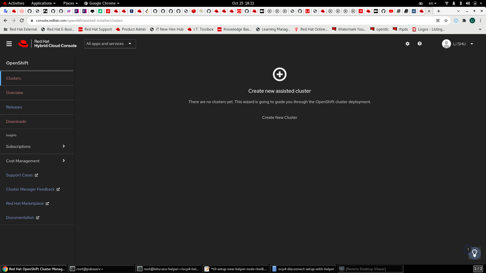  

3. 填写OpenShift集群的域名, 选择安装SNO, 并指定版本为4.9.x  
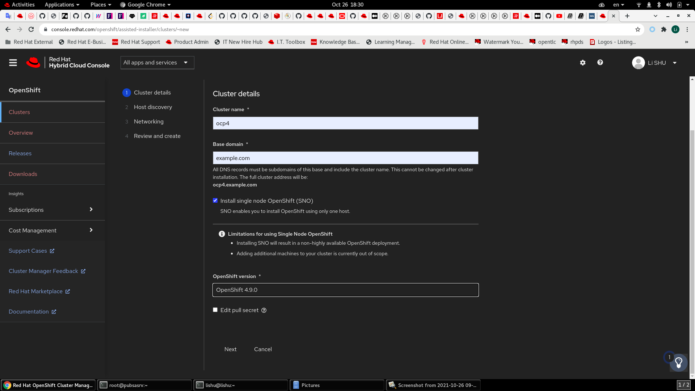  

4. 准备生成安装盘  
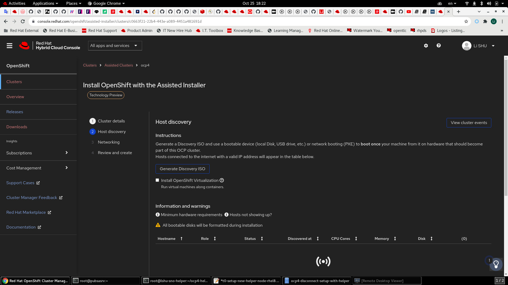  

5. 上传ssh公钥  
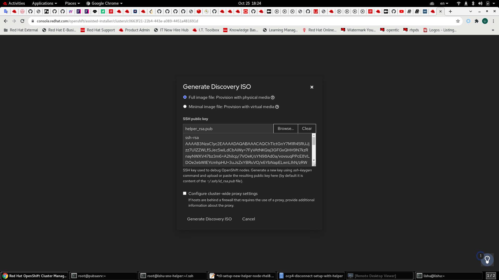  

6. 生成并下载安装盘ISO文件  
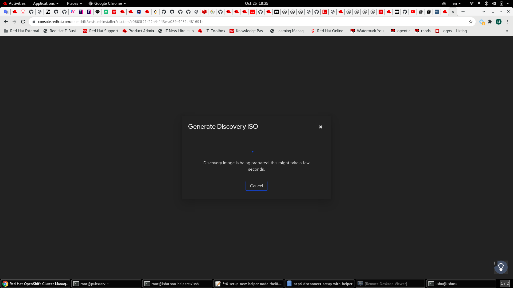  
拷贝命令

7. 用安装盘在本地启动SNO虚拟机  
```
virt-install --name="lshu-sno49" --vcpu=24 --ram=65536 --disk path=/opt/vms-disk/disk-sdc/lshu-sno49.qcow2,bus=virtio,size=130 --os-variant rhel8.0 --network network=nat4sno,mac=00:50:56:20:1f:2c --graphics vnc,listen=0.0.0.0 --noautoconsole --boot menu=on --cdrom /opt/iso/discovery_image_ocp4.iso
```
虚拟机启动后, 会向安装向导推送状态, 安装向导检查虚拟机的状态是否符合安装要求  
若状态就绪, 则进行下一步  
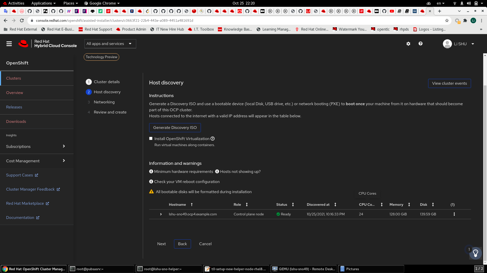  

8. 配置SNO的网络  
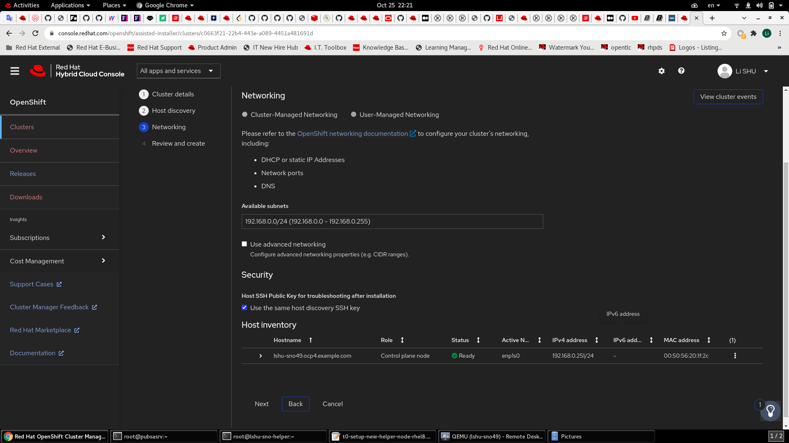  

9. 确认配置  
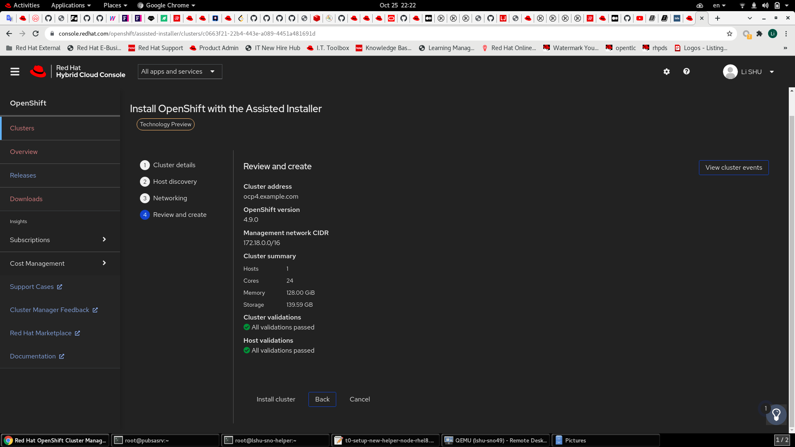  
若无问题, 点击 Install Cluster 链接进行安装  

10. 下载OpenShift容器镜像并完成本地SNO虚拟机的安装  
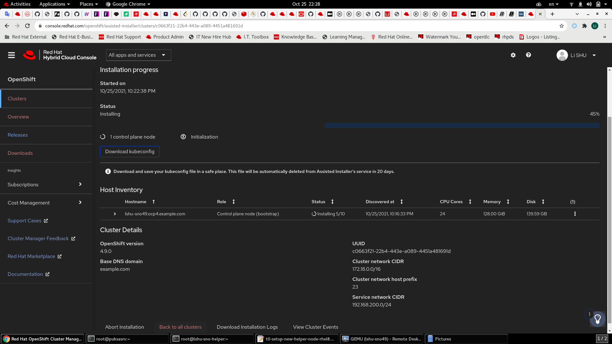  


11. 本地SNO虚拟机安装完成后, 虚拟机会自动停机  
手动启动本地SNO虚拟机, 继续OpenShift的安装  
```
virsh start lshu-sno49
```
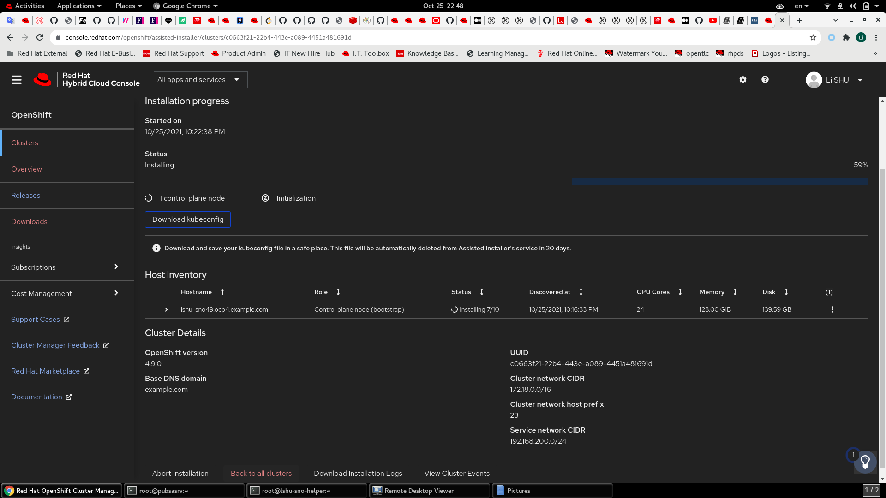  

12. 完成SNO的安装, 下载kubeconfig和kubeadmin的密码并妥善保存.  
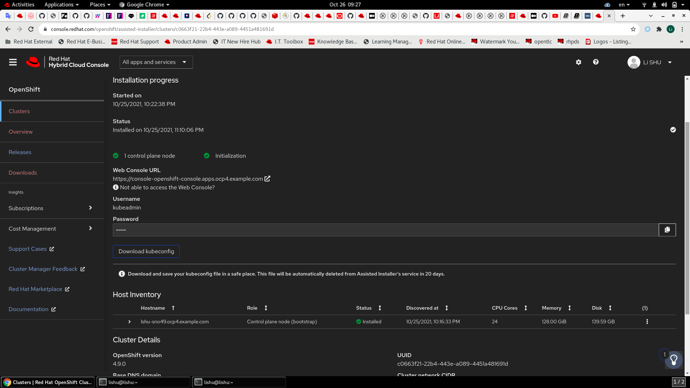  

13. 用ssh登录到SNO虚拟机, 更改网络配置为指定IP地址, 停机  
```
ssh core@lshu-sno49.ocp4.example.com
sudo -i
shutdown -h now
```

14. 上传lshu-sno49.qcow2文件到阿里云OSS对象存储  

15. 基于上传的磁盘文件创建虚拟机, 正确设置虚拟机的资源并启动虚拟机

到此, SNO可以正常使用了. 请记得即时保存SNO的登录配置和登录密码, 安装向导网站只保留20天.  
