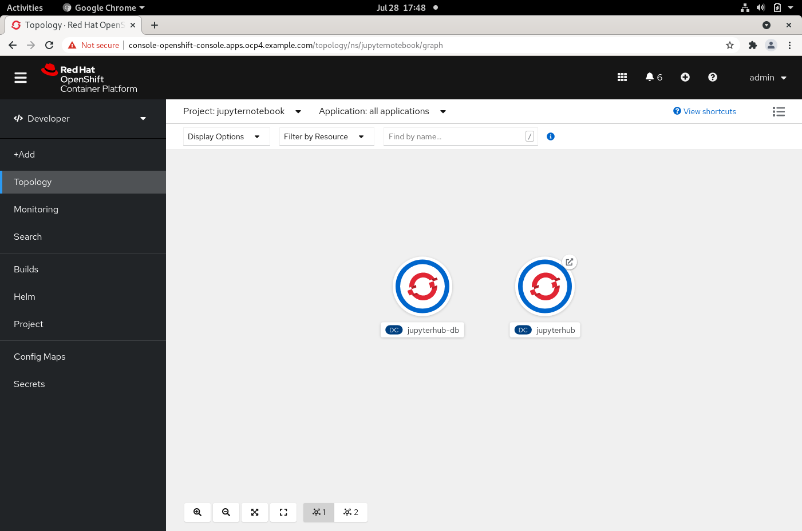
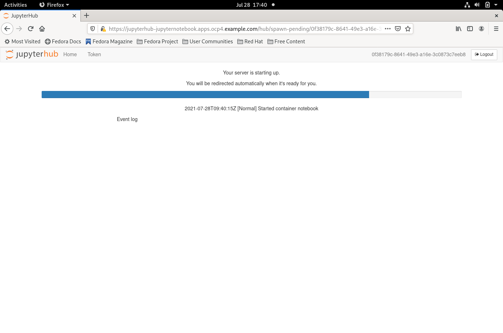
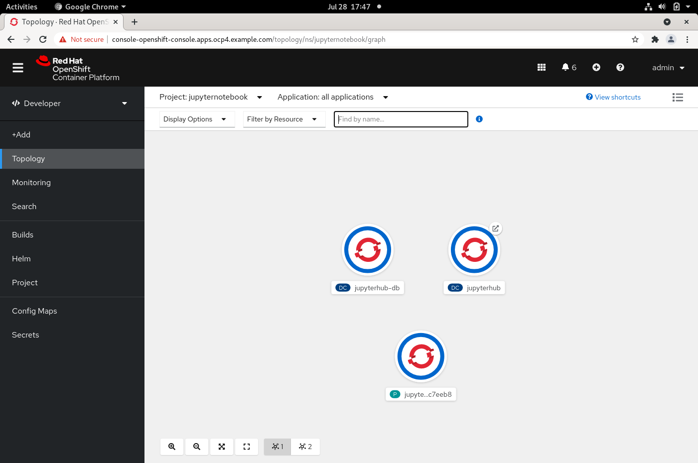
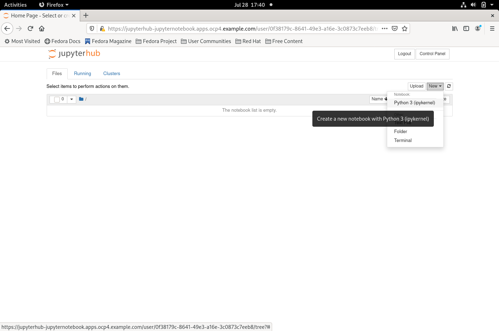
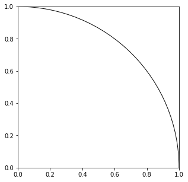
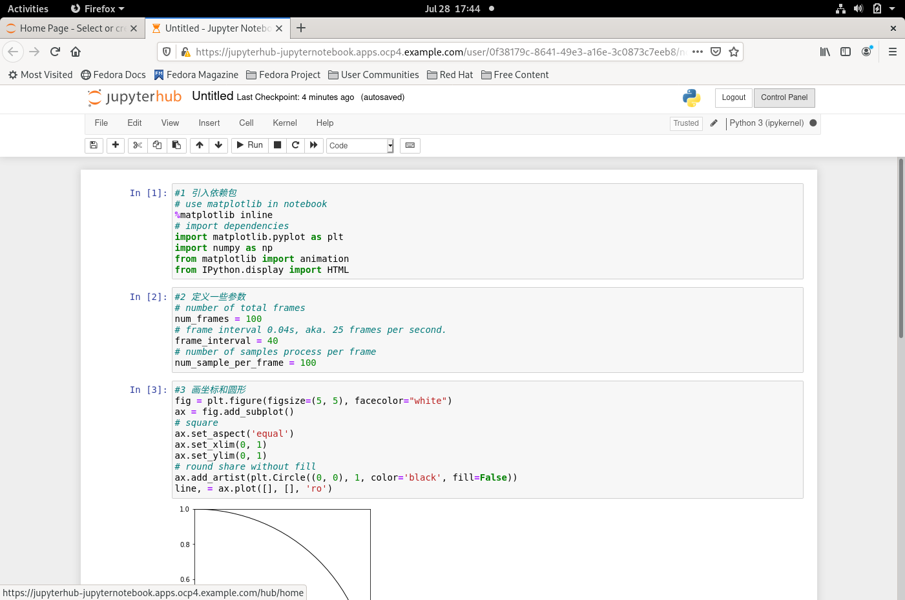
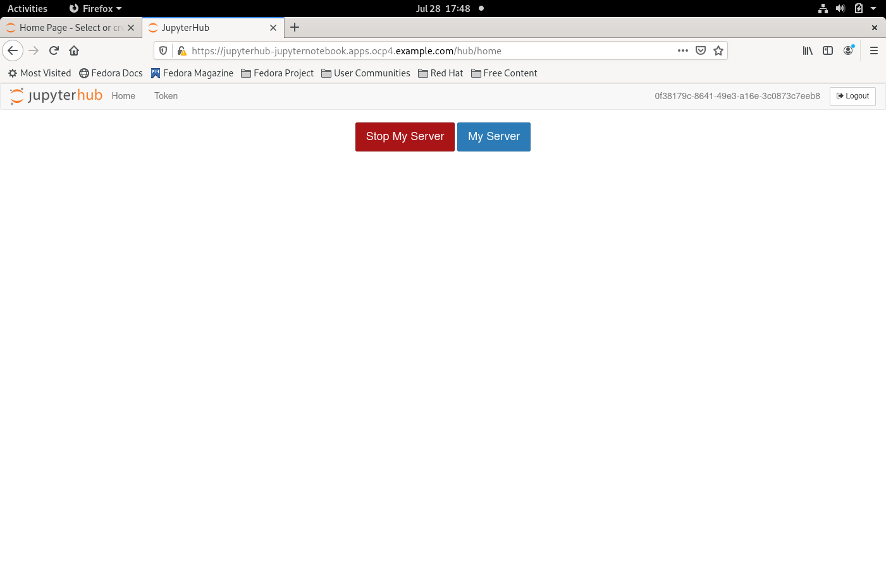

# OpenShift 容器平台上的 Jupyter 笔记本帮助落实数学实验教学  

前些日子, 上初中的女儿让我帮忙在 MatePAD 上调试她的数学老师设计的实验的程序, 很遗憾, 我没找到移动终端上可用的 SciPy<sup>1</sup> 环境, 这个数学实验没能在课上进行.  

我非常赞赏这个数学实验. 将实验引入数学教学在学界讨论了二十年, 已经达成了共识<sup>2,3,4</sup>, 但在落实的时候, 受到了诸多因素的制约, 毕竟没法安排数学课都在计算机教室上. 那么在移动设备普及的今天, 是否有方案让每个学生在班级教室通过移动设备的浏览器就能进行数学实验呢?  

OpenShift 容器平台<sup>5</sup>上的 Jupyter 笔记本<sup>6</sup>是一个成熟的开源<sup>7</sup>方案. 基于平台的能力, 每个学生用移动设备的浏览器访问校内数学实验系统时, 都会启动一个独立的实验环境的容器, 互不影响, 简单的操作就可以实现动态的可视化; 并且资源占用少, 一台高配的 PC 机就能支持一个班的学生进行实验.  

下面以使用蒙特·卡罗方法<sup>8</sup>模拟计算圆周率的实验为例, 展示使用 OpenShift 容器平台上的 Jupyter 笔记本进行数学实验的过程. 无论是 iPad 上的 safari 浏览器, 还是 MatePAD 上的 chrome 浏览器, 都能够正常进行实验.  

## 搭建基于 OpenShift 容器平台上的 Jupyter 笔记本的校内数学实验系统  
请参考[红帽官网的安装手册](https://access.redhat.com/documentation/zh-cn/openshift_container_platform/4.2/html/installing/index)和众多的博客文章, 如, [OpenShift 4.2 离线安装补充记录](https://www.cnblogs.com/ericnie/p/11764124.html), 进行安装, 4台 PC 机即可搭建一个容器云环境.  

Jupyter 笔记本的镜像, 请参考[jupyter-on-openshift 项目](https://github.com/jupyter-on-openshift/)进行构建.  
> 需要注意的是, 若要 Jupyter 笔记本在页面上实现动态的可视化效果, 则需要在构建镜像时安装 FFmpeg<sup>9</sup> 软件.  
> 若安装的是高于 OpenShift v4.2 的版本, 直接使用 jupyter-on-openshift 项目提供的镜像, 则会遇到 [kubespawner 的 bug](https://github.com/jupyterhub/kubespawner/issues/354), 需要升级到对应的版本解决, 避免遇到[kubernetes-client 的一个未解决的 bug](https://github.com/kubernetes-client/python/issues/1333).  

在控制台页面创建 JupyterHub 应用模板:  
  

然后通过模板创建 JupyterHub 应用:  


至此这个校内数学实验系统已经就绪.  


## 进行实验  
用浏览器访问[实验系统的网址](), 系统会自动初始化一个实验环境的 POD:  



创建一个 python 笔记本:  


按步骤运行实验代码:  
```
#1 引入依赖包
# use matplotlib in notebook
%matplotlib inline
# import dependencies
import matplotlib.pyplot as plt
import numpy as np
from matplotlib import animation
from IPython.display import HTML

#2 定义一些参数
# number of total frames
num_frames = 100
# frame interval 0.04s, aka. 25 frames per second.
frame_interval = 40
# number of samples process per frame
num_sample_per_frame = 100

#3 定义数据处理的动画的函数
# i is number of frames, process num_sample_per_frame per frame
def animate(i):
    global inside_count
    num_total_samples = num_sample_per_frame * (i + 1)
    # samples process in the frame
    xy_subset = xy[:, (num_total_samples - num_sample_per_frame):num_total_samples]
    # collection caculate 
    in_marker = np.hypot(*xy_subset) <= 1
    in_xy = xy_subset[:, in_marker]
    out_xy = xy_subset[:, ~in_marker]

    inside_count += np.sum(in_marker)
    pi = inside_count / num_total_samples * 4

    ax.set_title('Monte-Carlo Method \n(N={:0>8d}'.format(num_total_samples)+', Pi Estimate: {:.6f}'.format(pi)+')')
    ax.scatter(*in_xy, c='g', s=4)
    ax.scatter(*out_xy, c='r', s=4)

#4 画坐标和圆形
fig = plt.figure(figsize=(5, 5), facecolor="white")
ax = fig.add_subplot()
# square
ax.set_aspect('equal')
ax.set_xlim(0, 1)
ax.set_ylim(0, 1)
# round share without fill
ax.add_artist(plt.Circle((0, 0), 1, color='black', fill=False))
line, = ax.plot([], [], 'ro')

#5 生成数据样本, 生成动画. 可反复执行, 每次的评估值都有差异.
# accumulator for points in round shape
inside_count = 0
# generate samples of (x,y)
xy = np.random.default_rng().random([2, num_frames * num_sample_per_frame])

# process animation.
anim = animation.FuncAnimation(fig, animate, frames=num_frames, interval=frame_interval, repeat=False)

# to generate animation video, wait for a minute...
HTML(anim.to_html5_video())
```
[](./jupyterhub-screenshots/Pi_simulated_by_Monte_Carlo_method.gif)

完成实验后停止实验环境(或者由老师在课后统一清理):  




## 参考
1. SciPy 是一个开源的 Python 算法库和数学工具包, https://zh.wikipedia.org/wiki/SciPy  
2. 《素质教育的新途径——开设数学实验与数学建模课》, 2000年, 何铭,杨振华,邱中华,孔告化,许立炜,胡国雷,唐加山, 电子高等教育学会2000年学术年会论文集  
3. 《数学实验与数学建模》, 2001年, 姜启源, 数学的实践与认识第31卷第5期  
4. 《中学数学实验初探》, 2002年, 许德刚, https://cdmd.cnki.com.cn/Article/CDMD-10718-2003083035.htm  
5. OpenShift 容器平台是企业级的云计算平台软件产品, https://www.redhat.com/zh/technologies/cloud-computing/openshift  
6. Jupyter 笔记本是一个功能强大的基于Web的交互式计算环境, https://zh.wikipedia.org/wiki/Jupyter  
7. 开源是开放源代码(Open Source)的简称, 是一种提供程序源代码的做法, https://zh.wikipedia.org/wiki/%E5%BC%80%E6%94%BE%E6%BA%90%E4%BB%A3%E7%A0%81  
8. 蒙特·卡罗方法(Monte Carlo method), 也称统计模拟方法, 是一种以概率统计理论为指导的一类非常重要的数值计算方法, https://baike.baidu.com/item/%E8%92%99%E7%89%B9%C2%B7%E5%8D%A1%E7%BD%97%E6%96%B9%E6%B3%95/8664362?fr=aladdin  
9. FFmpeg是数字多媒体处理工具, https://baike.baidu.com/item/ffmpeg/2665727  
