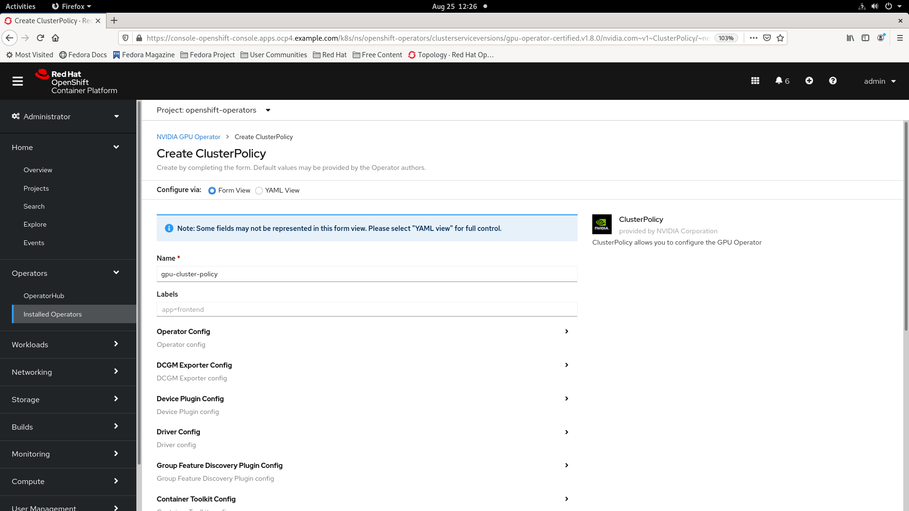
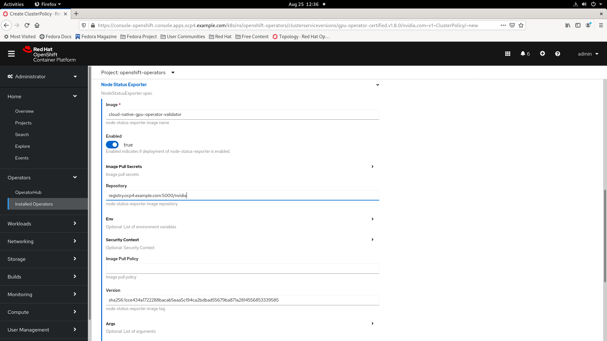

# OpenShift 4 离线环境搭建 - 安装 gpu operator

## 需要准备的离线安装介质  
1. OpenShift 4.6 的 Red Hat Operators 和 Certified Operators 离线镜像, 包含 NFD Operator 和 Nvidia GPU Operator  
2. 对应 RHCOS 内核版本的 headers/devel 和依赖的 rpm 包等, 如下:  
```
binutils-2.30-93.el8.x86_64.rpm
cpio-2.12-10.el8.x86_64.rpm
cpp-8.3.1-5.el8.x86_64.rpm
diffutils-3.6-6.el8.x86_64.rpm
dracut-049-135.git20210121.el8.x86_64.rpm
elfutils-libelf-0.182-3.el8.x86_64.rpm
elfutils-libelf-devel-0.182-3.el8.x86_64.rpm
gcc-8.3.1-5.el8.x86_64.rpm
glibc-2.28-151.el8.x86_64.rpm
glibc-all-langpacks-2.28-151.el8.x86_64.rpm
glibc-common-2.28-151.el8.x86_64.rpm
glibc-devel-2.28-151.el8.x86_64.rpm
glibc-headers-2.28-151.el8.x86_64.rpm
groff-base-1.22.3-18.el8.x86_64.rpm
hardlink-1.3-6.el8.x86_64.rpm
isl-0.16.1-6.el8.x86_64.rpm
kbd-2.0.4-10.el8.x86_64.rpm
kbd-legacy-2.0.4-10.el8.noarch.rpm
kbd-misc-2.0.4-10.el8.noarch.rpm
kernel-core-4.18.0-193.60.2.el8_2.x86_64.rpm
kernel-devel-4.18.0-193.60.2.el8_2.x86_64.rpm
kernel-headers-4.18.0-193.60.2.el8_2.x86_64.rpm
kmod-25-17.el8.x86_64.rpm
kpartx-0.8.4-10.el8.x86_64.rpm
libgomp-8.3.1-5.el8.x86_64.rpm
libkcapi-1.2.0-2.el8.x86_64.rpm
libkcapi-hmaccalc-1.2.0-2.el8.x86_64.rpm
libmpc-1.1.0-9.1.el8.x86_64.rpm
libpkgconf-1.4.2-1.el8.x86_64.rpm
libxcrypt-4.1.1-4.el8.x86_64.rpm
libxcrypt-devel-4.1.1-4.el8.x86_64.rpm
linux-firmware-20201218-102.git05789708.el8.noarch.rpm
memstrack-0.1.11-1.el8.x86_64.rpm
ncurses-6.1-7.20180224.el8.x86_64.rpm
perl-Carp-1.42-396.el8.noarch.rpm
perl-constant-1.33-396.el8.noarch.rpm
perl-Encode-2.97-3.el8.x86_64.rpm
perl-Errno-1.28-419.el8.x86_64.rpm
perl-Exporter-5.72-396.el8.noarch.rpm
perl-File-Path-2.15-2.el8.noarch.rpm
perl-File-Temp-0.230.600-1.el8.noarch.rpm
perl-Getopt-Long-2.50-4.el8.noarch.rpm
perl-HTTP-Tiny-0.074-1.el8.noarch.rpm
perl-interpreter-5.26.3-419.el8.x86_64.rpm
perl-IO-1.38-419.el8.x86_64.rpm
perl-libs-5.26.3-419.el8.x86_64.rpm
perl-macros-5.26.3-419.el8.x86_64.rpm
perl-MIME-Base64-3.15-396.el8.x86_64.rpm
perl-parent-0.237-1.el8.noarch.rpm
perl-PathTools-3.74-1.el8.x86_64.rpm
perl-Pod-Escapes-1.07-395.el8.noarch.rpm
perl-podlators-4.11-1.el8.noarch.rpm
perl-Pod-Perldoc-3.28-396.el8.noarch.rpm
perl-Pod-Simple-3.35-395.el8.noarch.rpm
perl-Pod-Usage-1.69-395.el8.noarch.rpm
perl-Scalar-List-Utils-1.49-2.el8.x86_64.rpm
perl-Socket-2.027-3.el8.x86_64.rpm
perl-Storable-3.11-3.el8.x86_64.rpm
perl-Term-ANSIColor-4.06-396.el8.noarch.rpm
perl-Term-Cap-1.17-395.el8.noarch.rpm
perl-Text-ParseWords-3.30-395.el8.noarch.rpm
perl-Text-Tabs+Wrap-2013.0523-395.el8.noarch.rpm
perl-threads-2.21-2.el8.x86_64.rpm
perl-threads-shared-1.58-2.el8.x86_64.rpm
perl-Time-Local-1.280-1.el8.noarch.rpm
perl-Unicode-Normalize-1.25-396.el8.x86_64.rpm
pigz-2.4-4.el8.x86_64.rpm
pkgconf-1.4.2-1.el8.x86_64.rpm
pkgconf-m4-1.4.2-1.el8.noarch.rpm
pkgconf-pkg-config-1.4.2-1.el8.x86_64.rpm
procps-ng-3.3.15-6.el8.x86_64.rpm
systemd-239-45.el8.x86_64.rpm
systemd-libs-239-45.el8.x86_64.rpm
systemd-pam-239-45.el8.x86_64.rpm
systemd-udev-239-45.el8.x86_64.rpm
xz-5.2.4-3.el8.x86_64.rpm
zlib-1.2.11-17.el8.x86_64.rpm
zlib-devel-1.2.11-17.el8.x86_64.rpm
```


## 安装 nfd operator
在控制台的 OperatorHub 页面查询 nfd 点击找到的 nfd operator 进行安装  
  

点击 Install 按钮安装 nfd operator  
  

使用默认的配置安装 nfd operator, 点击 Install 按钮继续  
  

若安装 pending, 可能需要清理环境, 重新安装来解决  

[参考产品文档](https://docs.openshift.com/container-platform/4.6/support/troubleshooting/troubleshooting-operator-issues.html)  
```
oc get event -n openshift-operators
...
75s         Normal    RequirementsUnknown   clusterserviceversion/nfd.4.6.0-202107291702          requirements not yet checked
75s         Normal    RequirementsNotMet    clusterserviceversion/nfd.4.6.0-202107291702          one or more requirements couldn't be found
...


oc get sub,csv -n openshift-operators
NAME                                    PACKAGE   SOURCE                       CHANNEL
subscription.operators.coreos.com/nfd   nfd       my-redhat-opertors-catalog   4.6

NAME                                                                DISPLAY                  VERSION              REPLACES                 PHASE
clusterserviceversion.operators.coreos.com/nfd.4.6.0-202107291702   Node Feature Discovery   4.6.0-202107291702   nfd.4.6.0-202107291702   Pending


oc delete subscription nfd -n openshift-operators
oc delete csv nfd.4.6.0-202107291702 -n openshift-operators


oc get job,configmap -n openshift-marketplace
NAME                                                                        COMPLETIONS   DURATION   AGE
job.batch/2cc447a08a0889a05f76c5236cad818310a9677de5fcbd982ba8778a1f0099f   1/1           15s        6d22h
job.batch/42ab5b0353407ac4f61c75301c46869101668de320be43d3fafbfb4f47d8f47   1/1           17s        6d21h

NAME                                                                        DATA   AGE
configmap/2cc447a08a0889a05f76c5236cad818310a9677de5fcbd982ba8778a1f0099f   2      6d22h
configmap/42ab5b0353407ac4f61c75301c46869101668de320be43d3fafbfb4f47d8f47   7      6d21h
configmap/marketplace-operator-lock                                         0      6d22h
configmap/marketplace-trusted-ca                                            1      14d


oc delete job 2cc447a08a0889a05f76c5236cad818310a9677de5fcbd982ba8778a1f0099f -n openshift-marketplace
oc delete job 42ab5b0353407ac4f61c75301c46869101668de320be43d3fafbfb4f47d8f47 -n openshift-marketplace
oc delete configmap 2cc447a08a0889a05f76c5236cad818310a9677de5fcbd982ba8778a1f0099f -n openshift-marketplace
oc delete configmap 42ab5b0353407ac4f61c75301c46869101668de320be43d3fafbfb4f47d8f47 -n openshift-marketplace


oc get sub,csv,installplan -n openshift-operators
No resources found in openshift-operators namespace.
```

安装成功  
  

进入 nfd operator 的 node feature discovery 标签页, 点击按钮创建 node feature discovery  
  

创建NFD成功  
  

用以下命令查看  
```
oc get pod -n openshift-operators 
NAME                            READY   STATUS    RESTARTS   AGE
nfd-master-8gwhp                1/1     Running   0          9s
nfd-master-bgmwb                1/1     Running   0          9s
nfd-master-qjbdt                1/1     Running   0          9s
nfd-operator-86bc798dd4-4l9bw   1/1     Running   0          98s
nfd-worker-6jdt8                1/1     Running   0          10s
nfd-worker-lzw4w                1/1     Running   0          10s
nfd-worker-rc7cr                1/1     Running   0          10s


oc describe node sg03-media-02.ocp4.example.com 
Name:               sg03-media-02.ocp4.example.com
Roles:              worker
Labels:             beta.kubernetes.io/arch=amd64
                    beta.kubernetes.io/os=linux
                    feature.node.kubernetes.io/cpu-cpuid.ADX=true
                    feature.node.kubernetes.io/cpu-cpuid.AESNI=true
                    feature.node.kubernetes.io/cpu-cpuid.AVX=true
                    feature.node.kubernetes.io/cpu-cpuid.AVX2=true
                    feature.node.kubernetes.io/cpu-cpuid.AVX512BW=true
                    feature.node.kubernetes.io/cpu-cpuid.AVX512CD=true
                    feature.node.kubernetes.io/cpu-cpuid.AVX512DQ=true
                    feature.node.kubernetes.io/cpu-cpuid.AVX512F=true
                    feature.node.kubernetes.io/cpu-cpuid.AVX512VL=true
                    feature.node.kubernetes.io/cpu-cpuid.FMA3=true
                    feature.node.kubernetes.io/cpu-cpuid.HLE=true
                    feature.node.kubernetes.io/cpu-cpuid.IBPB=true
                    feature.node.kubernetes.io/cpu-cpuid.MPX=true
                    feature.node.kubernetes.io/cpu-cpuid.RTM=true
                    feature.node.kubernetes.io/cpu-cpuid.STIBP=true
                    feature.node.kubernetes.io/cpu-cpuid.VMX=true
                    feature.node.kubernetes.io/cpu-hardware_multithreading=true
                    feature.node.kubernetes.io/cpu-pstate.turbo=true
                    feature.node.kubernetes.io/cpu-rdt.RDTCMT=true
                    feature.node.kubernetes.io/cpu-rdt.RDTL3CA=true
                    feature.node.kubernetes.io/cpu-rdt.RDTMBA=true
                    feature.node.kubernetes.io/cpu-rdt.RDTMBM=true
                    feature.node.kubernetes.io/cpu-rdt.RDTMON=true
                    feature.node.kubernetes.io/custom-rdma.available=true
                    feature.node.kubernetes.io/kernel-selinux.enabled=true
                    feature.node.kubernetes.io/kernel-version.full=4.18.0-193.41.1.el8_2.x86_64
                    feature.node.kubernetes.io/kernel-version.major=4
                    feature.node.kubernetes.io/kernel-version.minor=18
                    feature.node.kubernetes.io/kernel-version.revision=0
                    feature.node.kubernetes.io/memory-numa=true
                    feature.node.kubernetes.io/network-sriov.capable=true
                    feature.node.kubernetes.io/pci-102b.present=true
                    feature.node.kubernetes.io/pci-10de.present=true
                    feature.node.kubernetes.io/pci-14e4.present=true
                    feature.node.kubernetes.io/pci-8086.present=true
                    feature.node.kubernetes.io/pci-8086.sriov.capable=true
                    feature.node.kubernetes.io/system-os_release.ID=rhcos
                    feature.node.kubernetes.io/system-os_release.OPENSHIFT_VERSION=4.6
                    feature.node.kubernetes.io/system-os_release.RHEL_VERSION=8.2
                    feature.node.kubernetes.io/system-os_release.VERSION_ID=4.6
                    feature.node.kubernetes.io/system-os_release.VERSION_ID.major=4
                    feature.node.kubernetes.io/system-os_release.VERSION_ID.minor=6
                    kubernetes.io/arch=amd64
                    kubernetes.io/hostname=sg03-media-02.ocp4.example.com
                    kubernetes.io/os=linux
                    node-role.kubernetes.io/worker=
                    node.openshift.io/os_id=rhcos
                    nvidia.com/gpu.deploy.container-toolkit=true
                    nvidia.com/gpu.deploy.dcgm=true
                    nvidia.com/gpu.deploy.dcgm-exporter=true
                    nvidia.com/gpu.deploy.device-plugin=true
                    nvidia.com/gpu.deploy.driver=true
                    nvidia.com/gpu.deploy.gpu-feature-discovery=true
                    nvidia.com/gpu.deploy.node-status-exporter=true
                    nvidia.com/gpu.deploy.operator-validator=true
                    nvidia.com/gpu.present=true
Annotations:        machineconfiguration.openshift.io/currentConfig: rendered-worker-865f31e7dfd76b24b1da7d8ab92540b5
                    machineconfiguration.openshift.io/desiredConfig: rendered-worker-865f31e7dfd76b24b1da7d8ab92540b5
                    machineconfiguration.openshift.io/reason: 
                    machineconfiguration.openshift.io/ssh: accessed
                    machineconfiguration.openshift.io/state: Done
                    nfd.node.kubernetes.io/extended-resources: 
                    nfd.node.kubernetes.io/feature-labels:
                      cpu-cpuid.ADX,cpu-cpuid.AESNI,cpu-cpuid.AVX,cpu-cpuid.AVX2,cpu-cpuid.AVX512BW,cpu-cpuid.AVX512CD,cpu-cpuid.AVX512DQ,cpu-cpuid.AVX512F,cpu-...
                    nfd.node.kubernetes.io/worker.version: 1.15
                    volumes.kubernetes.io/controller-managed-attach-detach: true
...
```

## 安装 GPU Operator  
在 helper 节点上配置 GPU 驱动所依赖的 repo  
```
cd /var/www/html/
tar zxvf /opt/helper-disconnected-install/gpu-ocp-coreos-4.6.42-rpms.tar.gz
restorecon -vR /var/www/html/
systemctl restart httpd


cat > local.repo << EOF
[gpu-dependent]
name=gpu-dependent
baseurl=http://10.144.239.11:8080/gpu-ocp-coreos-4.6.42-rpms/
enabled=1
gpgcheck=0
```

在 gpu-operator-resources 项目中创建名为 repo-config 内容为 local.repo 的 configmap   
```
oc create project gpu-operator-resources
oc create configmap repo-config -n gpu-operator-resources --from-file local.repo
```

在控制台的 OperatorHub 页面查询 gpu 点击找到的 nvidia gpu operator 进行安装  
  

点击 Install 按钮安装 nvidia gpu operator  
  

使用默认的配置安装 nvidia gpu operator, 点击 Install 按钮继续  
  

安装成功  
  

进入 nvidia gpu operator 的 clusterpolicy 标签页, 点击按钮创建 clusterpolicy  
  

填写 clusterpolicy 配置参数  
  

填写其中的 operator config 参数  
  

填写其中的 DCMG Exporter config 参数  
  

填写其中的 device plugin config 参数  
  

填写其中的 driver config 参数  
  

填写其中的 Group Feature Discovery Plugin config 参数  
  

填写其中的 container toolkit config 参数  
  

填写其中的 Dcmg 参数  
  

填写其中的 Node Status Exporter 参数  
  

填写其中的 Mig Manager 参数  
  

填写其中的 Validator 参数  
  

创建clusterpolicy成功  
  

用以下命令查看, 已经有 gpu 的对应的 label 了  
```
oc get pod
NAME                                       READY   STATUS     RESTARTS   AGE
gpu-feature-discovery-lz7hz                0/1     Init:0/1   0          3s
nvidia-container-toolkit-daemonset-dpbls   0/1     Init:0/1   0          3s
nvidia-dcgm-d6ptp                          0/1     Init:0/1   0          4s
nvidia-dcgm-exporter-vx6mk                 0/1     Init:0/2   0          4s
nvidia-device-plugin-daemonset-glm2j       0/1     Init:0/1   0          3s
nvidia-driver-daemonset-bgdsl              1/1     Running    0          46s
nvidia-node-status-exporter-6f4l4          1/1     Running    0          46s
nvidia-operator-validator-947fz            0/1     Init:0/4   0          3s


oc describe node sg03-media-02.ocp4.example.com 
Name:               sg03-media-02.ocp4.example.com
Roles:              worker
Labels:             beta.kubernetes.io/arch=amd64
                    beta.kubernetes.io/os=linux
                    feature.node.kubernetes.io/cpu-cpuid.ADX=true
                    feature.node.kubernetes.io/cpu-cpuid.AESNI=true
                    feature.node.kubernetes.io/cpu-cpuid.AVX=true
                    feature.node.kubernetes.io/cpu-cpuid.AVX2=true
                    feature.node.kubernetes.io/cpu-cpuid.AVX512BW=true
                    feature.node.kubernetes.io/cpu-cpuid.AVX512CD=true
                    feature.node.kubernetes.io/cpu-cpuid.AVX512DQ=true
                    feature.node.kubernetes.io/cpu-cpuid.AVX512F=true
                    feature.node.kubernetes.io/cpu-cpuid.AVX512VL=true
                    feature.node.kubernetes.io/cpu-cpuid.FMA3=true
                    feature.node.kubernetes.io/cpu-cpuid.HLE=true
                    feature.node.kubernetes.io/cpu-cpuid.IBPB=true
                    feature.node.kubernetes.io/cpu-cpuid.MPX=true
                    feature.node.kubernetes.io/cpu-cpuid.RTM=true
                    feature.node.kubernetes.io/cpu-cpuid.STIBP=true
                    feature.node.kubernetes.io/cpu-cpuid.VMX=true
                    feature.node.kubernetes.io/cpu-hardware_multithreading=true
                    feature.node.kubernetes.io/cpu-pstate.turbo=true
                    feature.node.kubernetes.io/cpu-rdt.RDTCMT=true
                    feature.node.kubernetes.io/cpu-rdt.RDTL3CA=true
                    feature.node.kubernetes.io/cpu-rdt.RDTMBA=true
                    feature.node.kubernetes.io/cpu-rdt.RDTMBM=true
                    feature.node.kubernetes.io/cpu-rdt.RDTMON=true
                    feature.node.kubernetes.io/custom-rdma.available=true
                    feature.node.kubernetes.io/kernel-selinux.enabled=true
                    feature.node.kubernetes.io/kernel-version.full=4.18.0-193.41.1.el8_2.x86_64
                    feature.node.kubernetes.io/kernel-version.major=4
                    feature.node.kubernetes.io/kernel-version.minor=18
                    feature.node.kubernetes.io/kernel-version.revision=0
                    feature.node.kubernetes.io/memory-numa=true
                    feature.node.kubernetes.io/network-sriov.capable=true
                    feature.node.kubernetes.io/pci-102b.present=true
                    feature.node.kubernetes.io/pci-10de.present=true
                    feature.node.kubernetes.io/pci-14e4.present=true
                    feature.node.kubernetes.io/pci-8086.present=true
                    feature.node.kubernetes.io/pci-8086.sriov.capable=true
                    feature.node.kubernetes.io/system-os_release.ID=rhcos
                    feature.node.kubernetes.io/system-os_release.OPENSHIFT_VERSION=4.6
                    feature.node.kubernetes.io/system-os_release.RHEL_VERSION=8.2
                    feature.node.kubernetes.io/system-os_release.VERSION_ID=4.6
                    feature.node.kubernetes.io/system-os_release.VERSION_ID.major=4
                    feature.node.kubernetes.io/system-os_release.VERSION_ID.minor=6
                    kubernetes.io/arch=amd64
                    kubernetes.io/hostname=sg03-media-02.ocp4.example.com
                    kubernetes.io/os=linux
                    node-role.kubernetes.io/worker=
                    node.openshift.io/os_id=rhcos
                    nvidia.com/cuda.driver.major=470
                    nvidia.com/cuda.driver.minor=57
                    nvidia.com/cuda.driver.rev=02
                    nvidia.com/cuda.runtime.major=11
                    nvidia.com/cuda.runtime.minor=4
                    nvidia.com/gfd.timestamp=1629866069
                    nvidia.com/gpu.compute.major=6
                    nvidia.com/gpu.compute.minor=1
                    nvidia.com/gpu.count=1
                    nvidia.com/gpu.deploy.container-toolkit=true
                    nvidia.com/gpu.deploy.dcgm=true
                    nvidia.com/gpu.deploy.dcgm-exporter=true
                    nvidia.com/gpu.deploy.device-plugin=true
                    nvidia.com/gpu.deploy.driver=true
                    nvidia.com/gpu.deploy.gpu-feature-discovery=true
                    nvidia.com/gpu.deploy.node-status-exporter=true
                    nvidia.com/gpu.deploy.operator-validator=true
                    nvidia.com/gpu.family=pascal
                    nvidia.com/gpu.machine=PowerEdge-R740
                    nvidia.com/gpu.memory=5059
                    nvidia.com/gpu.present=true
                    nvidia.com/gpu.product=Quadro-P2000
                    nvidia.com/mig.strategy=single
Annotations:        machineconfiguration.openshift.io/currentConfig: rendered-worker-865f31e7dfd76b24b1da7d8ab92540b5
                    machineconfiguration.openshift.io/desiredConfig: rendered-worker-865f31e7dfd76b24b1da7d8ab92540b5
                    machineconfiguration.openshift.io/reason: 
                    machineconfiguration.openshift.io/ssh: accessed
                    machineconfiguration.openshift.io/state: Done
                    nfd.node.kubernetes.io/extended-resources: 
                    nfd.node.kubernetes.io/feature-labels:
                      cpu-cpuid.ADX,cpu-cpuid.AESNI,cpu-cpuid.AVX,cpu-cpuid.AVX2,cpu-cpuid.AVX512BW,cpu-cpuid.AVX512CD,cpu-cpuid.AVX512DQ,cpu-cpuid.AVX512F,cpu-...
                    nfd.node.kubernetes.io/worker.version: 1.15
                    volumes.kubernetes.io/controller-managed-attach-detach: true
...
```


查看 driver pod 的日志, 看 nvidia gpu driver 的安装过程  
```
oc logs nvidia-driver-daemonset-bgdsl
+ set -eu
+ RUN_DIR=/run/nvidia
+ PID_FILE=/run/nvidia/nvidia-driver.pid
+ DRIVER_VERSION=470.57.02
+ KERNEL_UPDATE_HOOK=/run/kernel/postinst.d/update-nvidia-driver
+ NUM_VGPU_DEVICES=0
+ RESOLVE_OCP_VERSION=false
+ '[' 1 -eq 0 ']'
+ command=init
+ shift
+ case "${command}" in
++ getopt -l accept-license -o a --
+ options=' --'
+ '[' 0 -ne 0 ']'
+ eval set -- ' --'
++ set -- --
+ ACCEPT_LICENSE=
++ uname -r
+ KERNEL_VERSION=4.18.0-193.41.1.el8_2.x86_64
+ PRIVATE_KEY=
+ PACKAGE_TAG=
+ for opt in ${options}
+ case "$opt" in
+ shift
+ break
+ '[' 0 -ne 0 ']'
+ _resolve_rhel_version
+ '[' -f /host-etc/os-release ']'
+ echo 'Resolving RHEL version...'
Resolving RHEL version...
+ local version=
++ cat /host-etc/os-release
++ grep '^ID='
++ awk -F= '{print $2}'
++ sed -e 's/^"//' -e 's/"$//'
+ local id=rhcos
+ '[' rhcos = rhcos ']'
++ cat /host-etc/os-release
++ awk -F= '{print $2}'
++ grep RHEL_VERSION
++ sed -e 's/^"//' -e 's/"$//'
+ version=8.2
+ '[' -z 8.2 ']'
+ RHEL_VERSION=8.2
+ echo 'Proceeding with RHEL version 8.2'
Proceeding with RHEL version 8.2
+ return 0
+ _resolve_ocp_version
+ '[' false = true ']'
+ return 0
+ init
+ '[' passthrough = vgpu ']'
+ sh NVIDIA-Linux-x86_64-470.57.02.run -x
Creating directory NVIDIA-Linux-x86_64-470.57.02
Verifying archive integrity... OK
Uncompressing NVIDIA Accelerated Graphics Driver for Linux-x86_64 470.57.02.......................................................................................................................................................................................................................................................................................................................................................................................................................................................................................................................................................................................................

+ cd NVIDIA-Linux-x86_64-470.57.02
+ sh /tmp/install.sh nvinstall

WARNING: Unable to determine the default X library path. The path /tmp/null/lib will be used, but this path was not detected in the ldconfig(8) cache, and no directory exists at this path, so it is likely that libraries installed there will not be found by the loader.

WARNING: You specified the '--no-kernel-module' command line option, nvidia-installer will not install a kernel module as part of this driver installation, and it will not remove existing NVIDIA kernel modules not part of an earlier NVIDIA driver installation.  Please ensure that an NVIDIA kernel module matching this driver version is installed separately.

WARNING: Unable to determine the path to install the libglvnd EGL vendor library config files. Check that you have pkg-config and the libglvnd development libraries installed, or specify a path with --glvnd-egl-config-path.

+ mkdir -p /usr/src/nvidia-470.57.02
+ mv LICENSE mkprecompiled kernel /usr/src/nvidia-470.57.02
+ sed '9,${/^\(kernel\|LICENSE\)/!d}' .manifest
+ echo -e '\n========== NVIDIA Software Installer ==========\n'

========== NVIDIA Software Installer ==========

Starting installation of NVIDIA driver version 470.57.02 for Linux kernel version 4.18.0-193.41.1.el8_2.x86_64

+ echo -e 'Starting installation of NVIDIA driver version 470.57.02 for Linux kernel version 4.18.0-193.41.1.el8_2.x86_64\n'
+ exec
+ flock -n 3
+ echo 1708008
+ trap 'echo '\''Caught signal'\''; exit 1' HUP INT QUIT PIPE TERM
+ trap _shutdown EXIT
+ _unload_driver
+ rmmod_args=()
+ local rmmod_args
+ local nvidia_deps=0
+ local nvidia_refs=0
+ local nvidia_uvm_refs=0
+ local nvidia_modeset_refs=0
+ echo 'Stopping NVIDIA persistence daemon...'
Stopping NVIDIA persistence daemon...
+ '[' -f /var/run/nvidia-persistenced/nvidia-persistenced.pid ']'
+ '[' -f /var/run/nvidia-gridd/nvidia-gridd.pid ']'
+ '[' -f /var/run/nvidia-fabricmanager/nv-fabricmanager.pid ']'
Unloading NVIDIA driver kernel modules...
+ echo 'Unloading NVIDIA driver kernel modules...'
+ '[' -f /sys/module/nvidia_modeset/refcnt ']'
+ '[' -f /sys/module/nvidia_uvm/refcnt ']'
+ '[' -f /sys/module/nvidia/refcnt ']'
+ '[' 0 -gt 0 ']'
+ '[' 0 -gt 0 ']'
+ '[' 0 -gt 0 ']'
+ '[' 0 -gt 0 ']'
+ return 0
+ _unmount_rootfs
Unmounting NVIDIA driver rootfs...
+ echo 'Unmounting NVIDIA driver rootfs...'
+ findmnt -r -o TARGET
+ grep /run/nvidia/driver
+ _kernel_requires_package
+ local proc_mount_arg=
+ echo 'Checking NVIDIA driver packages...'
Checking NVIDIA driver packages...
+ [[ ! -d /usr/src/nvidia-470.57.02/kernel ]]
+ cd /usr/src/nvidia-470.57.02/kernel
+ proc_mount_arg='--proc-mount-point /lib/modules/4.18.0-193.41.1.el8_2.x86_64/proc'
++ ls -d -1 'precompiled/**'
+ return 0
+ _update_package_cache
+ '[' '' '!=' builtin ']'
Updating the package cache...
+ echo 'Updating the package cache...'
+ yum -q makecache
+ _install_prerequisites
++ mktemp -d
+ local tmp_dir=/tmp/tmp.Ww7Xe3AuvG
+ trap 'rm -rf /tmp/tmp.Ww7Xe3AuvG' EXIT
+ cd /tmp/tmp.Ww7Xe3AuvG
+ echo 'Installing elfutils...'
Installing elfutils...
+ dnf install -q -y elfutils-libelf.x86_64 elfutils-libelf-devel.x86_64

Installed:
  elfutils-libelf-devel-0.182-3.el8.x86_64    zlib-devel-1.2.11-17.el8.x86_64   

+ rm -rf /lib/modules/4.18.0-193.41.1.el8_2.x86_64
+ mkdir -p /lib/modules/4.18.0-193.41.1.el8_2.x86_64/proc
Enabling RHOCP and EUS RPM repos...
+ echo 'Enabling RHOCP and EUS RPM repos...'
+ dnf config-manager --set-enabled rhocp-4.6-for-rhel-8-x86_64-rpms
Updating Subscription Management repositories.
Unable to read consumer identity
Subscription Manager is operating in container mode.
Error: No matching repo to modify: rhocp-4.6-for-rhel-8-x86_64-rpms.
+ true
+ dnf makecache --releasever=8.2
Updating Subscription Management repositories.
Unable to read consumer identity
Subscription Manager is operating in container mode.
gpu-ocp-coreos-4-6-21                           3.0 MB/s | 3.0 kB     00:00    
Metadata cache created.
+ dnf config-manager --set-enabled rhel-8-for-x86_64-baseos-eus-rpms
Updating Subscription Management repositories.
Unable to read consumer identity
Subscription Manager is operating in container mode.
Error: No matching repo to modify: rhel-8-for-x86_64-baseos-eus-rpms.
+ true
+ dnf makecache --releasever=8.2
Updating Subscription Management repositories.
Unable to read consumer identity
Subscription Manager is operating in container mode.
gpu-ocp-coreos-4-6-21                           3.0 MB/s | 3.0 kB     00:00    
Metadata cache created.
Installing Linux kernel headers...
+ echo 'Installing Linux kernel headers...'
+ dnf -q -y --releasever=8.2 install kernel-headers-4.18.0-193.41.1.el8_2.x86_64 kernel-devel-4.18.0-193.41.1.el8_2.x86_64
+ ln -s /usr/src/kernels/4.18.0-193.41.1.el8_2.x86_64 /lib/modules/4.18.0-193.41.1.el8_2.x86_64/build
Installing Linux kernel module files...
+ echo 'Installing Linux kernel module files...'
+ dnf -q -y --releasever=8.2 install kernel-core-4.18.0-193.41.1.el8_2.x86_64
+ touch /lib/modules/4.18.0-193.41.1.el8_2.x86_64/modules.order
+ touch /lib/modules/4.18.0-193.41.1.el8_2.x86_64/modules.builtin
+ depmod 4.18.0-193.41.1.el8_2.x86_64
Generating Linux kernel version string...
+ echo 'Generating Linux kernel version string...'
+ extract-vmlinux /lib/modules/4.18.0-193.41.1.el8_2.x86_64/vmlinuz
+ strings
+ grep -E '^Linux version'
+ sed 's/^\(.*\)\s\+(.*)$/\1/'
+ '[' -z 'Linux version 4.18.0-193.41.1.el8_2.x86_64 (mockbuild@x86-vm-08.build.eng.bos.redhat.com) (gcc version 8.3.1 20191121 (Red Hat 8.3.1-5) (GCC)) #1 SMP Wed Jan 13 11:33:33 EST 2021' ']'
+ mv version /lib/modules/4.18.0-193.41.1.el8_2.x86_64/proc
++ cat /lib/modules/4.18.0-193.41.1.el8_2.x86_64/proc/version
++ grep -Eo 'gcc version ([0-9\.]+)'
++ grep -Eo '([0-9\.]+)'
+ local gcc_version=8.3.1
++ rpm -qa gcc
+ local current_gcc=gcc-8.4.1-1.el8.x86_64
+ echo 'kernel requires gcc version: '\''gcc-8.3.1'\'', current gcc version is '\''gcc-8.4.1-1.el8.x86_64'\'''
kernel requires gcc version: 'gcc-8.3.1', current gcc version is 'gcc-8.4.1-1.el8.x86_64'
+ [[ gcc-8.3.1 != \g\c\c\-\8\.\4\.\1\-\1\.\e\l\8\.\x\8\6\_\6\4* ]]
+ dnf install -q -y --releasever=8.2 gcc-8.3.1

Downgraded:
  cpp-8.3.1-5.el8.x86_64   gcc-8.3.1-5.el8.x86_64   libgomp-8.3.1-5.el8.x86_64  

++ rm -rf /tmp/tmp.Ww7Xe3AuvG
+ _create_driver_package
+ local pkg_name=nvidia-modules-4.18.0
+ local nvidia_sign_args=
+ local nvidia_modeset_sign_args=
+ local nvidia_uvm_sign_args=
+ trap 'make -s -j SYSSRC=/lib/modules/4.18.0-193.41.1.el8_2.x86_64/build clean > /dev/null' EXIT
+ echo 'Compiling NVIDIA driver kernel modules...'
Compiling NVIDIA driver kernel modules...
+ cd /usr/src/nvidia-470.57.02/kernel
+ make -s -j SYSSRC=/lib/modules/4.18.0-193.41.1.el8_2.x86_64/build nv-linux.o nv-modeset-linux.o
/usr/src/nvidia-470.57.02/kernel/nvidia/nv-dma.c:963: warning: "IMPORT_SGT_STUBS_NEEDED" redefined
 #define IMPORT_SGT_STUBS_NEEDED 0
 
/usr/src/nvidia-470.57.02/kernel/nvidia/nv-dma.c:957: note: this is the location of the previous definition
 #define IMPORT_SGT_STUBS_NEEDED 1
 
/usr/src/nvidia-470.57.02/kernel/nvidia-drm/nvidia-drm-crtc.c: In function 'plane_req_config_update':
/usr/src/nvidia-470.57.02/kernel/nvidia-drm/nvidia-drm-crtc.c:89:9: warning: unused variable 'ret' [-Wunused-variable]
     int ret = 0;
         ^~~
/usr/src/nvidia-470.57.02/kernel/nvidia-drm/nvidia-drm-crtc.c: In function 'nv_drm_plane_atomic_set_property':
/usr/src/nvidia-470.57.02/kernel/nvidia-drm/nvidia-drm-crtc.c:371:32: warning: unused variable 'nv_drm_plane_state' [-Wunused-variable]
     struct nv_drm_plane_state *nv_drm_plane_state =
                                ^~~~~~~~~~~~~~~~~~
/usr/src/nvidia-470.57.02/kernel/nvidia-drm/nvidia-drm-modeset.c: In function '__will_generate_flip_event':
/usr/src/nvidia-470.57.02/kernel/nvidia-drm/nvidia-drm-modeset.c:96:23: warning: unused variable 'primary_plane' [-Wunused-variable]
     struct drm_plane *primary_plane = crtc->primary;
                       ^~~~~~~~~~~~~
Relinking NVIDIA driver kernel modules...
+ echo 'Relinking NVIDIA driver kernel modules...'
+ rm -f nvidia.ko nvidia-modeset.ko
+ ld -d -r -o nvidia.ko ./nv-linux.o ./nvidia/nv-kernel.o_binary
+ ld -d -r -o nvidia-modeset.ko ./nv-modeset-linux.o ./nvidia-modeset/nv-modeset-kernel.o_binary
Building NVIDIA driver package nvidia-modules-4.18.0...
+ '[' -n '' ']'
+ echo 'Building NVIDIA driver package nvidia-modules-4.18.0...'
+ ../mkprecompiled --pack nvidia-modules-4.18.0 --description 4.18.0-193.41.1.el8_2.x86_64 --proc-mount-point /lib/modules/4.18.0-193.41.1.el8_2.x86_64/proc --driver-version 470.57.02 --kernel-interface nv-linux.o --linked-module-name nvidia.ko --core-object-name nvidia/nv-kernel.o_binary --target-directory . --kernel-interface nv-modeset-linux.o --linked-module-name nvidia-modeset.ko --core-object-name nvidia-modeset/nv-modeset-kernel.o_binary --target-directory . --kernel-module nvidia-uvm.ko --target-directory .
+ mkdir -p precompiled
+ mv nvidia-modules-4.18.0 precompiled
++ make -s -j SYSSRC=/lib/modules/4.18.0-193.41.1.el8_2.x86_64/build clean
+ _cleanup_package_cache
Cleaning up the package cache...
+ '[' '' '!=' builtin ']'
+ echo 'Cleaning up the package cache...'
+ rm -rf '/var/cache/yum/*'
+ _install_driver
Installing NVIDIA driver kernel modules...
+ install_args=()
+ local install_args
+ echo 'Installing NVIDIA driver kernel modules...'
+ cd /usr/src/nvidia-470.57.02
+ rm -rf /lib/modules/4.18.0-193.41.1.el8_2.x86_64/video
+ '[' '' = yes ']'
+ IGNORE_CC_MISMATCH=1
+ nvidia-installer --kernel-module-only --no-drm --ui=none --no-nouveau-check

WARNING: The nvidia-drm module will not be installed. As a result, DRM-KMS will not function with this installation of the NVIDIA driver.


ERROR: Unable to open 'kernel/dkms.conf' for copying (No such file or directory)


Welcome to the NVIDIA Software Installer for Unix/Linux

Detected 56 CPUs online; setting concurrency level to 32.
Installing NVIDIA driver version 470.57.02.
A precompiled kernel interface for kernel '4.18.0-193.41.1.el8_2.x86_64' has been found here: ./kernel/precompiled/nvidia-modules-4.18.0.
Required file 'nv-peermem-linux.o' not found in package './kernel/precompiled/nvidia-modules-4.18.0'
Performing CC sanity check with CC="/usr/bin/cc".
Performing CC check.
Kernel source path: '/lib/modules/4.18.0-193.41.1.el8_2.x86_64/source'

Kernel output path: '/lib/modules/4.18.0-193.41.1.el8_2.x86_64/build'

Performing Compiler check.
Performing Dom0 check.
Performing Xen check.
Performing PREEMPT_RT check.
Performing vgpu_kvm check.
Cleaning kernel module build directory.
Building kernel modules
  : [##############################] 100%
Kernel module compilation complete.
Unable to determine if Secure Boot is enabled: No such file or directory
Kernel messages:
[595010.198340] IPv6: ADDRCONF(NETDEV_CHANGE): eth0: link becomes ready
[595010.208644] device vethc57d3206 entered promiscuous mode
[595010.225861] IPv6: ADDRCONF(NETDEV_UP): eth0: link is not ready
[595010.232126] IPv6: ADDRCONF(NETDEV_UP): eth0: link is not ready
[595010.275575] IPv6: ADDRCONF(NETDEV_UP): eth0: link is not ready
[595010.282174] IPv6: ADDRCONF(NETDEV_CHANGE): eth0: link becomes ready
[595010.310741] IPv6: ADDRCONF(NETDEV_CHANGE): eth0: link becomes ready
[595010.317380] IPv6: ADDRCONF(NETDEV_CHANGE): eth0: link becomes ready
[595010.334745] IPv6: ADDRCONF(NETDEV_UP): eth0: link is not ready
[595010.353587] IPv6: ADDRCONF(NETDEV_UP): eth0: link is not ready
[595010.359673] device veth5d8398e1 entered promiscuous mode
[595010.365418] IPv6: ADDRCONF(NETDEV_CHANGE): eth0: link becomes ready
[595010.389805] IPv6: ADDRCONF(NETDEV_CHANGE): eth0: link becomes ready
[595010.460458] device veth2406895d entered promiscuous mode
[595010.528802] device vethd2bad66d entered promiscuous mode
[595010.596848] device veth1a351cc5 entered promiscuous mode
[595010.663135] device veth134419d0 entered promiscuous mode
[595098.663502] nvidia-nvlink: Nvlink Core is being initialized, major device number 509
[595098.664660] nvidia 0000:3b:00.0: vgaarb: changed VGA decodes: olddecodes=none,decodes=none:owns=none
[595098.866510] NVRM: loading NVIDIA UNIX x86_64 Kernel Module  470.57.02  Tue Jul 13 16:14:05 UTC 2021
[595098.898159] nvidia-uvm: Loaded the UVM driver, major device number 507.
[595098.903959] nvidia-modeset: Loading NVIDIA Kernel Mode Setting Driver for UNIX platforms  470.57.02  Tue Jul 13 16:06:24 UTC 2021
[595098.909877] nvidia-modeset: Unloading
[595099.081373] nvidia-uvm: Unloaded the UVM driver.
[595099.094741] nvidia-nvlink: Unregistered the Nvlink Core, major device number 509
Installing 'NVIDIA Accelerated Graphics Driver for Linux-x86_64' (470.57.02):
  Installing: [##############################] 100%
Driver file installation is complete.
Running post-install sanity check:
  Checking: [##############################] 100%
Post-install sanity check passed.
Running runtime sanity check:
  Checking: [##############################] 100%
Runtime sanity check passed.

Installation of the kernel module for the NVIDIA Accelerated Graphics Driver for Linux-x86_64 (version 470.57.02) is now complete.

+ _load_driver
Loading ipmi and i2c_core kernel modules...
+ echo 'Loading ipmi and i2c_core kernel modules...'
+ modprobe -a i2c_core ipmi_msghandler ipmi_devintf
+ echo 'Loading NVIDIA driver kernel modules...'
Loading NVIDIA driver kernel modules...
+ modprobe -a nvidia nvidia-uvm nvidia-modeset
+ echo 'Starting NVIDIA persistence daemon...'
+ nvidia-persistenced --persistence-mode
Starting NVIDIA persistence daemon...
+ '[' passthrough = vgpu ']'
+ _assert_nvswitch_system
+ '[' -d /proc/driver/nvidia-nvswitch ']'
++ ls -1 '/proc/driver/nvidia-nvswitch/devices/*'
ls: cannot access '/proc/driver/nvidia-nvswitch/devices/*': No such file or directory
+ entries=
+ '[' -z '' ']'
+ return 1
+ _mount_rootfs
Mounting NVIDIA driver rootfs...
+ echo 'Mounting NVIDIA driver rootfs...'
+ mount --make-runbindable /sys
+ mount --make-private /sys
+ mkdir -p /run/nvidia/driver
+ mount --rbind / /run/nvidia/driver
+ echo 'Change device files security context for selinux compatibility'
Change device files security context for selinux compatibility
+ chcon -R -t container_file_t /run/nvidia/driver/dev
+ _write_kernel_update_hook
+ '[' '!' -d /run/kernel/postinst.d ']'
+ return
+ echo 'Done, now waiting for signal'
Done, now waiting for signal
+ trap 'echo '\''Caught signal'\''; _shutdown && { kill 1733182; exit 0; }' HUP INT QUIT PIPE TERM
+ trap - EXIT
+ true
+ wait 1733182
+ sleep infinity
```
