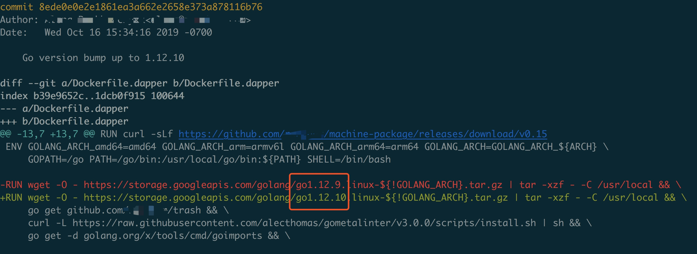
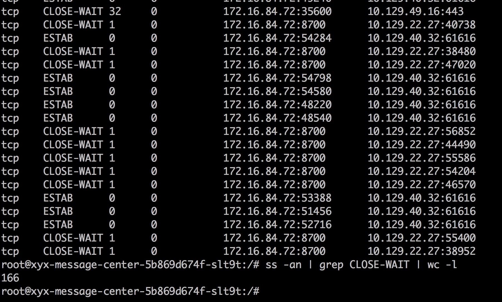
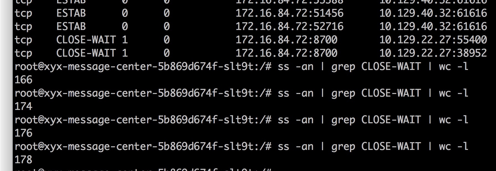
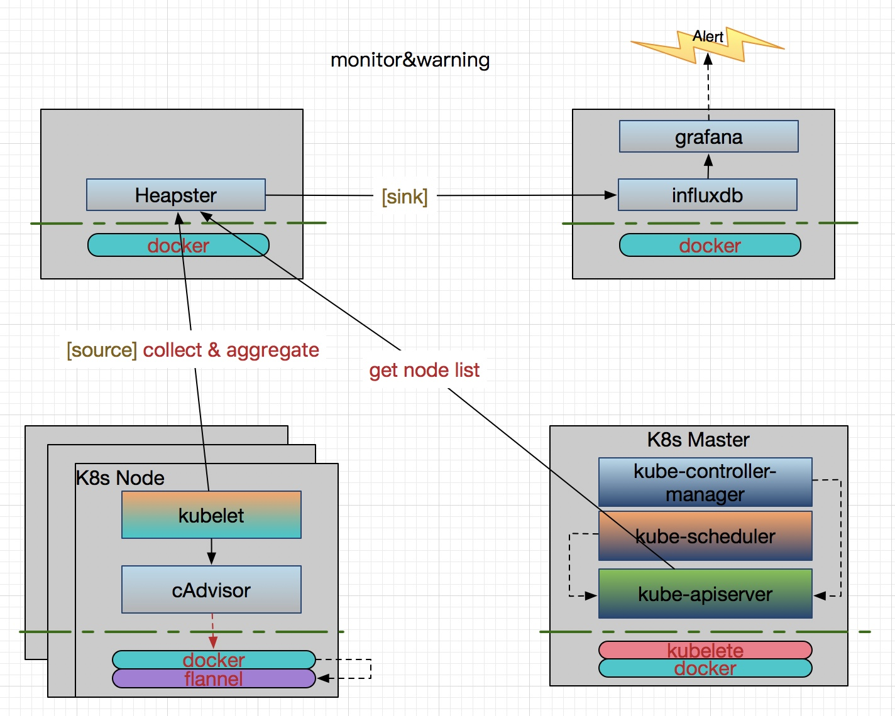
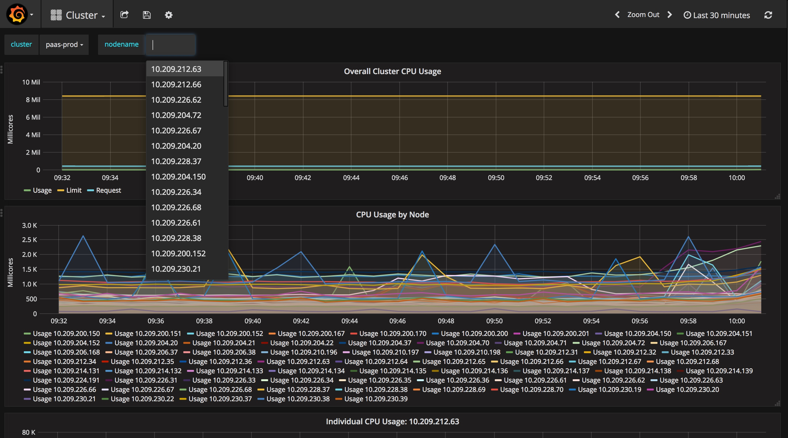
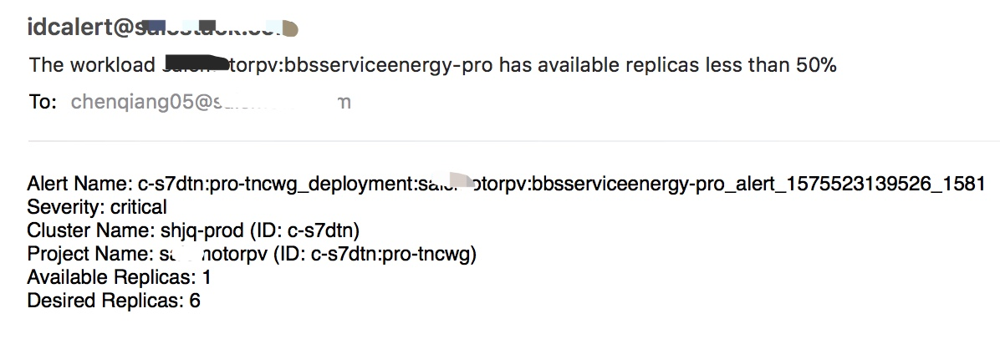
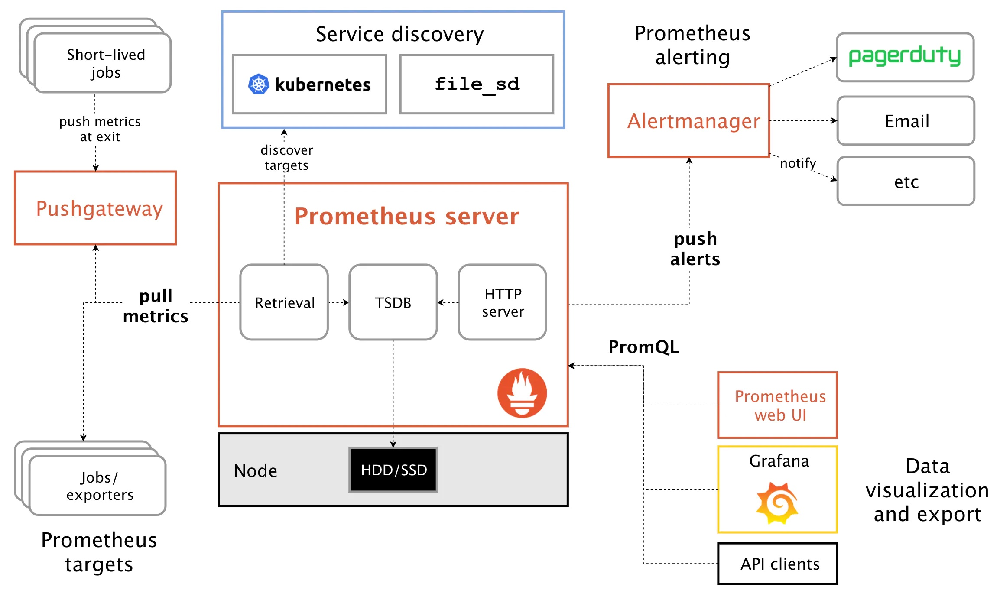
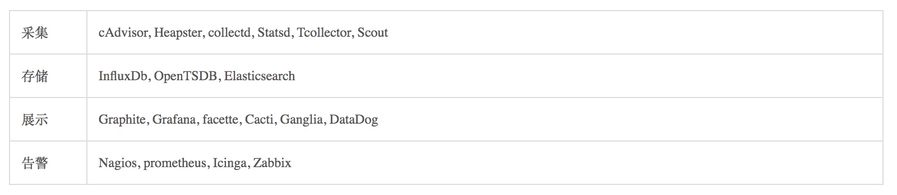

Table of Contents
=================

* [课程出品人](#课程出品人)
* [课程简介](#课程简介)
* [1、前言](#1前言)
* [2、分析问题](#2分析问题)
  * [2.1、简单化原则](#21简单化原则)
  * [2.2、时间点](#22时间点)
  * [2.3、上下文](#23上下文)
  * [2.4、环境场景](#24环境场景)
* [3、定位问题](#3定位问题)
  * [3.1、排除干扰项](#31排除干扰项)
  * [3.2、日志分析](#32日志分析)
     * [3.2.1、日志平台架构](#321日志平台架构)
     * [3.2.2、业务日志分析](#322业务日志分析)
  * [3.3、监控与告警](#33监控与告警)
     * [3.3.1、监控告警平台架构](#331监控告警平台架构)
        * [3.3.1.1、Heapster Influxdb Grafana 方案](#3311heapsterinfluxdbgrafana-方案)
        * [3.3.1.2、Promethues 方案](#3312promethues-方案)
     * [3.3.2、监控告警分析](#332监控告警分析)
* [4、复现问题](#4复现问题)
* [5、解决问题](#5解决问题)

# 课程出品人

陈强，目前就职于上汽集团云计算中心，容器云架构师及技术经理；
长年在云计算领域搬砖，曾就职于 Intel, IBM, 爱奇艺 等公司；有五年基于 Docker/Mesos/Kubernetes 的云容器研发经验，积累了丰富的生产实践经验，专注于云原生技术的研究。
2020 容器云职业技能大赛百位专家委员会成员。

# 课程简介

随着容器技术的出现，我们开发出的应用程序才可以真正实现一处打包多处部署的愿景，因为它比传统虚拟机定义了更具标准化的打包方式及更轻量级的运行状态。当业务很多时，如果我们只在一台主机上部署就不能满足业务的高可用、负载的可扩容性等需求，这时就需要我们在多台主机上部署，因此出现了集群化、分布式等技术。那我们如何在这些主机上更高效的管理这些容器，并以某些方式暴露所部署的应用服务？这就需要用到容器编排技术了，因此从 2014 年开始，容器领域就诞生了以 Mesos、Docker Swarm 及 Kubernetes 为代表的容器编排系统。在过去这几年间，容器编排技术已经呈现出“三国鼎立”之态势，各有个的用户群体，各有个的活动社区，但如今 Kubernetes 已经成为真正的领导者。一种新的技术的兴起，注定会带动围绕其出现的其他新技术的崛起，这包括了容器存储、容器网络、容器日志管理及监控告警、 CI/CD（持续集成/持续交付）等相关领域的技术，从而构成了我们今天火热的容器生态圈。在容器编排技术之上，我们为了更好的让开发者使用这个编排系统，就有了容器平台的出现，典型开源代表有 Rancher、Openshift、Kubesphere 等，它们都包括 CI/CD、灰度发布、滚动升级、自动扩缩容、租户管理、安全认证等等功能模块。每一个模块也都涌现出了很多新的技术代表，这些又构成了我们今天大势宣传的云原生技术。那这么多新技术组合在一起，当我们的容器平台或者部署在其上的业务出现问题时，我们该如何分析、定位并最后排除？这就是一个摆在云容器工作者面前的重要问题。在这个章节中我就分享一些解决问题的思路方法并以一个实际案例来分享如何排除一个真实场景中产生的问题，希望能起到抛砖引玉的效果并对大家有所帮助。由于容器平台涉及的问题太过宽广，使用的技术涉及知识面也很多，本章节并不能一一例举，只能点到为止。

---

# 1、前言

一个问题的的解决一般需要经过问题的分析、定位、复现到最后排除与解决等过程。每个过程几乎都环环相扣，只有肯定了前一个过程，才利于后续过程进行，当然这些过程可能会出现相互否定的时候，但经过几番否定后，最终会形成一个确定的方向，即定位出了问题点。再根据我们分析与排查中产生的思路、利用相关的工具及方法等进行问题复现，当问题复现后，问题就基本解决了 70%，接下来就是找到解决该问题的方法以及排除它，这个占了 30%，至此一个问题就解决了。
在容器平台中，我们除了会涉及操作系统层面的知识，还会涉及容器存储、容器网络、容器日志管理及监控告警、 CI/CD（持续集成/持续交付）等相关领域的技术。每个领域都有可能是问题的产生点，只有在分析定位出具体点时，我们才好依据该技术相关工具或者阅读源码来解决它。

# 2、分析问题

分析问题就是需要了解问题发生的时间点，问题发生时的上下文，环境场景等，并分析问题之间的关联关系，应用”简单化原则“，这些都是我们分析问题的基础。
下面我会穿插一个实际案例来分享一下整个排错过程。
> 问题背景：容器平台上线一年多后，总有很少部分租户称他们的某个业务部署在 Kubernetes 容器平台后经常会重启，也很少部分租户称某个业务在运行一段时间时会产生大量的 `CLOSE-WAIT`，还有租户反馈说某个业务跑着就会 hang 住。刚开始我们都会让业务开发者先自己找问题，因为这些租户反映的只是偶偶发生，大多数租户没有反映类似问题，我们会理所当然的认为是租户业务自身问题，而非平台问题。当然大多数情况下，还是租户业务本身程序没有写好，或者健康检查配置不当等引起。

## 2.1、简单化原则

当我们在排查某个问题时，我们可以回想一下，最近发生了哪些问题，这些问题是否相互之间有依赖关系，如果可能有依赖关系，那么就可以利用现有解决方案进行 fix。
> 本章节中我要分享的这三个问题，经过我们排查后，都是同一个问题引起。像这种情况就需要我们进行初步地关联分析，并按照问题发生的难易程度进行排查。
比如，我们可以这样分析，假设这三个问题有关联的话，那么会不会是服务 hang 住了触发了其他两个？即 hang 住了，服务自然没法响应客户端的关闭连接，此时就会产生 CLOSE-WAIT；另外，如果 hang 住了，而业务在 K8S 平台又配置了 live probe 保活机制，那么就会触发容器自动重启。这么看来，我们首要解决的就是 hang 住的问题，但 hang 有很多原因引起，其实这里并不好排查，顺序可以先调整一下，因为更有可能是 CLOSE-WAIT 过多，把业务程序打爆，导致程序 hang 死。所以我们先从 CLOSE-WAIT 这种比较常见的问题入手，这也是我们遵寻简单原则的地方。

## 2.2、时间点

问题发生的时间点，可以让我们确定是在低峰还是高峰期发生的。如果是低峰期发生，很大可能是软件自身的重大问题，比如有内存泄漏、CPU 使用过高、磁盘 IO 消耗过大等，因为低峰期流量相对比较低，不容易受外在因素的影响。如果是高峰期发生，很大可能是高并发有问题，配置有问题（比如缓存池设置过小）或者有类似死锁、竞争等产生，甚至涉及到操作系统内核参数的配置问题，这些可能是程序 bug 了等。
> 上面这三个问题，虽不是同一段时间出现的，但我们通过故障事件统计下来，却是比较多的，这几个问题在高低峰都有出现过，所以不好排查是否是业务程序代码问题，最多说是业务代码出错可能性大点。
前面我说到了“故障事件统计”这个功能，这里我稍展开一下，这个其实对于容器平台工作人员来说，是一个很重要的功能，它可以帮助我们分析事件类型及其某类事件的统计值，这样方便看出在某个时间段哪些类型的事件比较多，也有利于我们定位事件之间的关联性，如果是平台问题引起，那么就可以迭代平台，进行改进。事件源可以有很多，比如 Kubernetes 集群本身的话，Kubernetes 核心 API 提供了各种 event 事件类型，比如 Pod 启动情况，被调度到哪些物理节点，ReplicaSet 扩缩副本数，Pod Unhealthy 原因，Node NotReady 信息，及与存储卷相关的 PV，PVC 等众多事件，这些它们默认情况下，只在 etcd 中保存 1 小时。我们为了分析，可以持久化这些事件信息，比如一周，一个月等，这个可以借助于开源的 [eventrouter](https://github.com/heptiolabs/eventrouter) 或者阿里的 [kube-eventer](https://github.com/AliyunContainerService/kube-eventer) ，把事件采集到日志系统进行搜索、分析、展示与告警等。在我们的生产环境中，目前就使用了 kube-eventer 来收集事件数据，并发送到 kafka，之后通过日志系统的 kafka 订阅功能写入后台 ElasticSearch 和 ClickHouse 中，并借助现在日志平台进行事件统计与分析。另外，Zabbix 等告警平台也会提供一些主机层面或者租户业务程序自定义埋点相关的事件告警，这些我们都可以收集起来，既可以方便查看时间点，也方便做事件统计分析。具体在这里不展开，请自行查阅相关文献。

另外，我们也要注意软件变更时间点，因为很多时候新问题的产生是由于软件变更引起的，比如容器平台软件在添加了新功能后，没有经过完整的集成测试或兼容性等系统测试，就可能会带来新的问题。当一个问题在某个时间点之后才产生，那么我们需要去看这个时间点之前所提交的程序代码，及相关的周边环境变动情况等来确定问题是否和这些相关。
> 虽然上面这三个问题和软件变更时间点无关，但我们在生产环境中就碰到了一次严重的“内存泄漏”事件。主要的现象就是内存由 1.5G 左右突然激增到 35G 大小，由于内存是不可压缩资源，在 K8S 中以 Pod 方式部署后，会触发 Pod 重启，并产生告警。我们注意到 2020 年 3 月 4 号之前，并未出现过该问题，之后才出现的，那么解决此问题的方法就是通过定位软件变更时间点来解决，变更时间点关联了代码提交点，所以我们只要检查 2020 年 3 月 4 号该时间点之前 commit 过了哪些代码。遗憾的是，刚开始，我们也查看了该时间段提交的代码，却没有发现什么可疑的代码。为什么前面"内存泄漏"打了双引号？就是因为我们最终排查下来，发现其现象是内存泄漏，但本质上却不是，这也是我们暂时通过代码没有发现问题的原因。
平台软件是用 golang 开发的，像内存泄漏这种事件，一般可以通过 pprof 这种内存分析工具来定位，网上有很多的教程，这里不对该工具进行展开。我们通过 pprof 工具获取了平台软件的 pprof 信息，从 heap-pprof 的常驻内存情况看，Runtime 使用的内存只有 1.5G，而系统看到整个进程的 RSS 内存高达 35G，差距非常之大。从发生问题的时间点看，bond0 流量突增，可能跟 API 请求的各个环节有关，涉及到外部系统调用平台 API，平台内部调用 Kubernetes API，这些请求无论是平台 server 主动发起还是被动接收，都涉及到非常多的类型转换，比如：json encoding/decoding，平台 Server 都需要分配相应的 内存。如果请求量非常大，可能就会导致内存激增。但是并没有发生内存泄露，也就是说是正常的内存分配，这一点我们从 pprof 的信息得到了确定，而且被分配的内存也没有被回收，我们看到内存在增长到一定阶段后非常平稳。那问题来了，为什么会没有被回收，golang 中不是都有自带内存回收机制吗？之后，我们带着问题，就去看 golang 的内存回收原理，并查看了网上相关资料，其中的一篇文章，[《Go 进程的 HeapReleased 上升，但是 RSS 不下降造成内存泄漏》](https://zhuanlan.zhihu.com/p/114340283) 和我们遇到的现象比较像。所以最终将问题定位到 GO Runtime 的内存释放机制上，在 Go 1.12 之前，golang runtime 会在未使用的内存上标志成 `MADV_DONTNEED` ，标记过的内存如果再次使用，会触发缺页中断，并且操作系统会立即回收未使用的内存页。从 Go 1.12 开始，该标志已更改为 `MADV_FREE`，这告诉操作系统它可以根据需要回收一些未使用的内存页面，即内核会等到内存紧张时才会释放，在释放之前，这块内存依然可以复用。这个特性从 Linux 4.5 版本内核开始支持，显然，`MADV_FREE` 是一种用空间换时间的优化。此时，我们再去查看该时间段提交的代码，果然发现有一个 commit 是在构建平台软件的 docker 镜像的 Dockerfile 中修改了 Golang 的语言版本，从 1.11 到 1.12.9 版本。

Go 1.12 之后，提供了一种方式强制回退使用 `MADV_DONTNEED` 的方式，在执行程序前添加 `GODEBUG=madvdontneed=1`。即解决这个问题的方法是将平台软件 Pod 中的 YAML 进行修改，添加环境变量 `GODEBUG=madvdontneed=1`，主动使其及时回收未在使用的内存，以释放内存空间。

## 2.3、上下文

问题发生时，可以通过查看日志记录，比如某条错误的或致命的日志来查找到对应的程序执行点，这个执行点的前后程序段就是这里所说的代码的上下文，也是软件的上下文。这个与前面软件变更的时间还是有点不同，这个是当发现日志中出现了某条错误日志时，根据该日志对应的代码行来定位的。通过它我们可以分析代码中执行了哪些特定的功能模块，分析问题产生的时机，触发点等，找出一些与问题相关的蛛丝马迹。

## 2.4、环境场景

环境场景主要指问题发生时，相关的外在环境，比如操作系统的内核版本、docker 版本、Kubernetes 版本等。如果问题的产生和这些环境相关，那么就需要考虑程序的兼容性场景，我们一般在开源社区中，给开源软件提交 bug 的时候，也会指定特定的软件环境，就是方便作者分析与定位问题。

# 3、定位问题

定位问题，是在分析问题后，我们可以接合各种日志、监控告警等平台提供的功能来排除干扰项，找到问题的诱发根因。

## 3.1、排除干扰项

分析完了问题，一般会根据经验先从比较简单的可能产生的影响因素开始排除干扰选项，这样我们大概就会有一个比较接近问题事实的方向。

> 比如上面三个问题中的其中一个 "容器内出现大量处于CLOSE_WAIT状态的TCP链接"：

`CLOSE-WAIT` 有很多原因引起，有可能是服务端代码处理 TCP 挥手不合理引起，比如忘记了 close 相应的 socket 连接，那么自然不会发出 FIN 包；还比如出现死循环之类的问题，导致 close 最后没有被调用执行；还有可能是服务端程序响应过慢，或者存在耗时逻辑，导致 close 延后；也可能是 accept 的 backlog 设置的太大，导致服务端来不及消费的情况，引起多余的请求还在队列里就被对方关闭了。还有可能是内核参数配置没有做优化处理，比如调整 `tcp_keepalive_time` / `tcp_keepalive_intvl` / `tcp_keepalive_probes` 等。林林总总，但经过我们排查后，以上的可能影响点都不是，所以排除上述这些干扰选项。

在排查业务问题的时候，我们还要结合`业务方`与`平台方`的各自对自身代码熟悉的优势，发挥出凝聚力，一起来排查。
> `业务方` - 从如下几个方向进行了代码方面的排查：1、多次检查 TCP 四次挥手代码逻辑；2、检查 spring boot 的相关配置是否恰当；3、由于连接数过多，也排查了 tomcat 线程池相关代码；4、修改 ActiveMQ 连接池的配置；5、采用 jstack、jmap 查看应用的线程堆栈，确定程序没有死锁，只看到少量线程在 block 和 wait 状态；6、采用 jstack -gcutil 查看 java 垃圾回收时间，因为其可能会引起垃圾回收异常等；以上发现都是正常的，无果。
`平台方` - 尝试过以下排查：1、修改 Kubernetes node 主机的内核相关配置（比如：tcp keepalived 相关参数，ulimit 限制数等）；2、检查 Kubernetes Ingress 入口 Nginx 的配置（比如：Kubernetes Nginx 的超时配置与业务自身 Nginx 的超时时间减少些，比如 900 秒；改用 NodePort 模式不经过 Nginx 代理等），发现同样有问题，这个就排除采用 Nginx 代理引起，也就排除了 Nginx 参数配置问题；3、排查 docker 分区的文件系统，排除容器底层导致；4、查看 dockerd 日志和系统日志；5、还有各种其他可能的方面都尝试过等等；以上的可能影响点都不是，所以排除上述这些干扰选项。

到此为止，虽然都没有找到一点头绪，但我们至少排除了很多干扰项，这个也是接近事实的必经之路。

> 当时在分析问题的过程中，实然闪现在我脑海中，会不会是程序本身 hang 住了，才引起了 CLOSE-WAIT 出现？这个问题其实是需要界定的，后面会讲到。

## 3.2、日志分析

日志平台是日志分析的主要工具，它也是收集业务容器日志及系统日志的输入口，业务日志的展示与统计、分析的窗口。容器的日志都需要统一输出到日志平台，有以下几点考虑：
- 因为容器的临时性，容器重启或销毁后就会丢失日志，所以需要日志平台的持久存储。
- 需要按日志存储时间、日志量大小、日志错误类型、业务访问率、客户端访问方式等等来搜索、分析。
- 需要以图形化展示各种统计效果，方便观察整体表现形为，抓住容易被忽视的抽像部分，也就是有大局观。

### 3.2.1、日志平台架构

下面我稍微简要介绍一些日志平台使用到的相关组件的概念，详情请参考相关文献。
早期一般使用 ELK 架构模式，即由 ElasticSearch、Logstash 和 Kiabana 三个开源工具组成：
- ElasticSearch 是一个基于 Lucene 的开源分布式搜索引擎。它的特点有很多，比如分布式，零配置，自动发现，索引自动分片，索引副本机制，restful风格接口，多数据源，自动搜索负载等等。它提供了一个分布式、多用户能力的全文搜索引擎，基于 RESTful web 接口。ElasticSearch 是用 Java 开发的，并作为 Apache 许可条款下的开放源码发布。设计用于云计算中，能够达到实时搜索，稳定，可靠，快速，安装使用方便。在 ElasticSearch 中，所有节点的数据是均等的。
- Logstash 是一个完全开源的工具，它可以对你的日志进行收集、过滤、分析，支持大量的数据获取方法，并将其存储以实现搜索、统计等功能。它带有一个 web 界面，可以搜索和展示所有日志。一般工作方式为 C/S 架构，Client 端安装在需要收集日志的主机上，Server 端负责将收到的各节点日志进行过滤、修改等。
- Kibana 是一个基于浏览器页面的 ElasticSearch 前端展示工具，也是一个开源和免费的工具，Kibana 可以为 Logstash 和 ElasticSearch 提供的日志分析友好的 Web 界面，可以帮助您汇总、分析和搜索重要数据日志。

最近一般我们采用 EFK 架构模式，即采用 fluentd 或者 fluent bit 来采集容器日志（包括标准控制台日志及用户自定义业务日志）代替 Logstash，其他工具保持不变。

- Fluentd 是一个开源的通用日志采集和分发系统，可以从多个数据源采集日志，并将日志过滤和加工后分发到多种存储和处理系统。Fluentd 处于日志采集流程的中间层。它可以从 Apache/Nginx 等广泛应用的系统、数据库、自定义系统中采集日志，数据进入 Fluentd 后可根据配置进行过滤、缓存，最终分发到各种后端系统中。这些后端系统包括告警系统（Nagios）、分析系统（MongoDB、MySQL、Hadoop、ElasticSearch）、存储系统（Amazon S3）等。也就是说，Fluentd 就是把通常的`日志采集-分发-存储`流程提炼出来，用户只需要考虑业务数据，至于数据的传输、容错等过程细节都交给 Fluentd 来做。
- fluent bit 是一个 C 实现的轻量级多平台开源日志收集工具，相比 fluentd 资源占用要小，相对的插件数量上要比 fluentd 要少的多，功能上也少一些。它允许从不同的源收集数据并发送到多个目的地。完全兼容 Docker 和 Kubernetes 生态环境。

在查询搜索方面，主流的有 ElasticSearch，目前也有很多公司开始使用 ClickHouse。

- ClickHouse 是近年来备受关注的开源列式数据库（columnar DBMS），主要用于数据分析（OLAP）领域。目前国内社区火热，各个大厂纷纷跟进大规模使用。
传统数据库在数据大小比较小，索引大小适合内存，数据缓存命中率足够高的情形下能正常提供服务。但这种理想情况最终会随着业务的增长而走到尽头，使得查询会变得越来越慢。我们可能会通过增加更多的内存，订购更快的磁盘等纵向扩展的方式来解决问题。如果我们的需求是解决怎样快速查询出结果，那么这就是 ClickHouse 的主场了。它适用于读多于写；大宽表，读大量行但是少量列，结果集较小；数据批量写入，且数据不更新或少更新；无需事务，数据一致性要求低；灵活多变，不适合预先建模等场景。

在我们的生产环境中，一般 7 天内的热日志从 ElasticSearch 中查询，7 天外的冷日志从 ClickHouse 中查询，因为随着天数的增加，数据量越来越多，ClickHouse 作用越来越明显。携程团队曾对 ClickHouse 与 ElasticSearch 做过一次比较，他们得出了如下结论：

- ClickHouse 写入吞吐量大，单服务器日志写入量在 50MB 到 200MB/s，每秒写入超过 60W 记录数，是 ElasticSearch 的五倍以上。在 ElasticSearch  中比较常见的写 Rejected 导致数据丢失、写入延迟等问题，在 ClickHouse 中不容易发生。
- 查询速度快，官方宣称数据在 pagecache 中，单服务器查询速率大约在 2-30GB/s；没在 pagecache 的情况下，查询速度取决于磁盘的读取速率和数据的压缩率。经测试 ClickHouse 的查询速度比 ElasticSearch 快 5-30 倍以上。
- ClickHouse 比 ElasticSearch 服务器成本更低。一方面 ClickHouse 的数据压缩比比 ElasticSearch 高，相同数据占用的磁盘空间只有 ElasticSearch 的 1/3 到 1/30，节省了磁盘空间的同时，也能有效的减少磁盘 IO，这也是 ClickHouse 查询效率更高的原因之一；另一方面 ClickHouse 比 ElasticSearch 占用更少的内存，消耗更少的 CPU 资源。我们预估用 ClickHouse 处理日志可以将服务器成本降低一半。
- 相比 ElasticSearch，ClickHouse 稳定性更高，运维成本更低。ElasticSearch 中不同的 Group 负载不均衡，有的 Group 负载高，会导致写 Rejected 等问题，需要人工迁移索引；在 ClickHouse 中通过集群和 Shard 策略，采用轮询写的方法，可以让数据比较均衡的分布到所有节点。ElasticSearch 中一个大查询可能导致 OOM 的问题；ClickHouse 通过预设的查询限制，会查询失败，不影响整体的稳定性。ElasticSearch 需要进行冷热数据分离，每天 200T 的数据搬迁，稍有不慎就会导致搬迁过程发生问题，一旦搬迁失败，热节点可能很快就会被撑爆，导致一大堆人工维护恢复的工作；ClickHouse 按天分 partition ，一般不需要考虑冷热分离，特殊场景用户确实需要冷热分离的，数据量也会小很多，ClickHouse 自带的冷热分离机制就可以很好的解决。
- ClickHouse 采用 SQL 语法，比 ElasticSearch 的 DSL 更加简单，学习成本更低。

### 3.2.2、业务日志分析

几乎每个容器平台团队，都会构建自己的日志平台，这样就方便在系统或业务出问题的时候进行排查。一些简单的问题，我们通过业务输出的日志就能够定位到问题，但很多情况下，一些棘手的问题，都需要结合日志统计分析，从全局观入手，还要我们善于观察细节，才好定位出问题点。

> 我们在定位上述三个问题的时候，也查看了业务日志，但刚开始没有发现什么可疑点，后面我们进行`统计分析`时发现，我们注意到几点：一个非常关键的信息，就是业务的单条日志太长了，目测单行有上万个字符（当然租户日志在生产中输出这么 多日志，本身就很不科学，正是这种不科学，才给了我们排查这个问题的机会！）。另外一个就是，1 秒钟输出了大量的日志，一条接一条，很快。这两个点，引起了我们的注意。
我们在和业务方排查问题时，我们又注意到一个问题，就是在 K8S 平台的该业务容器对应的控制台突然看不到业务日志输出了，会不会程序挂了？这个信息很关键，因为这个是一瞬间的事情，由于业务应用设置了健康检查，一旦检查失败超过设定次数，就会自动重启，然后日志重新正常输出，丢失了现场，或者没有注意到这些关键细节就不好排查了。这时执行  `ss -ant` 查看发现 `CLOSE-WAIT` 在不断的增加，而此前在日志正常输出时，只会产生少量 `CLOSE-WAIT`，所以我断定是业务挂了引起了 CLOSE-WAIT 的增加。我连续三次敲下统计命令，从图中也可以看出程序挂了后，其 CLOSE-WAIT 在不断的增加，从 166 -> 174->176->178，增长很快。

所以我们让租户把日志输出关闭后，重新压测两天后，并没有产生 `CLOSE-WAIT`，到这里我们基本断定了和日志输出有关了。也就是说整个过程是：先有日志过长，导致业务挂死（不过是单条日志过长引起，还是日志输出过快引起，这个需要后面进一步构建模拟代码来判断），最终出现大量 CLOSE-WAIT，业务挂了，健康检查失败了，容器自然会重启，突然发现，这三个问题有了关联了！为了证实猜想，我们就需要在之后构建测试程序，来模拟业务程序并复现 bug。

## 3.3、监控与告警

监控与告警平台是整个容器平台非常重要的辅助功能，它可以帮助我们守护集群健康并及时预警通知，它也是实现自动化运维的必经之路。

### 3.3.1、监控告警平台架构

监控告警平台，除了实现传统物理主机层面的监控外，主要会实现容器级别的业务状态、资源使用率等监控。主机层面的监控，可以采用传统的 Zabbix 进行，比较成熟，这里不做介绍。
容器级别监控的对象主要包括 K8S 集群（各组件）、应用服务、Pod、容器及网络等。这些对象主要表现为以下三个方面：
- K8S 集群自身健康状态监控 (kube-controller-manager/kube-scheduler/kube-apiserver/kubelet/kube-proxy 5 个基础组件、Docker、Etcd、网络插件 calico，DNS 等）
- 系统性能的监控，比如：cpu、内存、磁盘、网络、filesystem 及 processes 等；
- 业务资源状态监控，主要包括：rc/rs/deployment/hpa/ds、Pod、Service、Ingress 等；

K8S 组件相关的监控，早期一般会配合相关的 shell 脚本，通过 crond 开启后监控各组件状态，目前可以使用 Prometheus 来实现系统组件级别的监控。
容器相关的监控，早期采用传统的 Heapster+Influxdb+Grafana 方案，目前还是 Prometheus 用的比较多，下面会简要介绍这两种架构方案，具体还请参考相关文献。

#### 3.3.1.1、Heapster+Influxdb+Grafana 方案

- Cadvisor：将数据，写入InfluxDB
- InfluxDB ：时序数据库，提供数据的存储，存储在指定的目录下
- Grafana ：是一个开源的数据监控分析可视化平台，支持多种数据源配置(支持的数据源包括 InfluxDB，MySQL，Elasticsearch，OpenTSDB，Graphite 等)和丰富的插件及模板功能，支持图表权限控制和报警。

Heapster 首先从 K8S Master 获取集群中所有 Node 的信息，每个 Node 通过 `kubelet` 调用 `cAdvisor API` 来采集所有容器的数据信息（资源使用率和性能特征等）。这样既拿到了 Node 级别的资源使用状况信息，又拿到了容器级别的信息，它可以通过标签来分组这些信息，之后聚合所有监控数据，一起 `sink` 到 `Heapster` 配置的后端存储中（`Influxdb`)，通过 `Grafana` 来支持数据的可视化。所以需要为 Heapster 设置几个重要的启动参数，一个是 `--source` 用来指定 Master 的 URL 作为数据来源，一个是 `--sink` 用来指定使用的后端存储系统（Influxdb)，还有就是  `--metric_resolution` 来指定性能指标的精度，比如：`30s` 表示将过去 30 秒的数据进行聚合并存储。

这里说一下 Heapster 的后端存储，它有两个，一个是 `metricSink`，另一个是 `influxdbSink`。metricSink 是存放在本地内存中的 metrics 数据池，会默认创建，当集群比较大的时候，内存消耗会很大。Heapster API 获取到的数据都是从它那获取的。而 influxdbSink 接的是我们真正的数据存储后端，在新版本中支持多后端数据存储，比如可以指定多个不同的 influxDB 。

通过 Grafana， 用户可以使用各种正则表达式或者选项查看自己的业务监控详情，还可以按系统性能（cpu、内存、磁盘、网络、filesystem）进行排序查看等等。

当监控到一定的数量级，超过某个阈值时，将产生告警。虽然 Grafana 目前支持邮件进行一些简单的告警，但我们还是通过制定一些监控点、告警机制、告警等级等，然后接入公司内部现有告警平台来进行告警。
邮件告警示例如下：

#### 3.3.1.2、Promethues 方案

Prometheus 是一套开源的系统监控和报警框架，灵感源自 Google 的 Borgmon 监控系统。2012年，SoundCloud 的 Google 前员工创造了 Prometheus，并作为社区开源项目进行开发。2015 年，该项目正式发布。2016 年，Prometheus 加入云原生计算基金会（Cloud Native Computing Foundation），成为受欢迎度仅次于 Kubernetes 的项目。

Prometheus 具有以下特性：

- 多维的数据模型（基于时间序列的 Key、Value 键值对）
- 灵活的查询和聚合语言 PromQL
- 提供本地存储和分布式存储
- 通过基于 HTTP 的 Pull 模型采集时间序列数据
- 可利用 Pushgateway（Prometheus 的可选中间件）实现 Push 模式
- 可通过动态服务发现或静态配置发现目标机器
- 支持多种图表和数据大盘

具体的工作流程如下图所示，数据通过 job exporter 方式被动收集或者通过 Pushgateway 主动推送，还可以通过 service discovery 进行收集到 Prometheus server 中，Prometheus server 会进行加工处理，并将其存储到特有的 TSDB 数据库，并将数据落盘到主机或者外挂远程持久存储卷中，并以 HTTP server 方式暴露该服务，Grafana 利用 Prometheus 提供的 API 接口对接以实现数据的可视化，当监控到异常情况时，可通过 AlertManager 实现告警，默认的有对接到邮件等，还可以通过 Webhook 来扩展功能，比如对接到公司已有的告警平台，简单易用。

以上从几个典型的架构上介绍了一些监控，但可能都不是最优实践。这个需要我们根据生产环境的特点结合每个监控产品的优势来达到适合我们监控的目的。比如 Grafana 的图表展示能力强，但是没有很好的告警功能，那么可以结合 Prometheus 在数据处理能力改善数据分析的展示。下面列了一些监控产品，但并不是严格按表格进行分类，比如 Prometheus 和 Zabbix 都有采集、展示、告警的功能。但都可以了解一下，各取所长。

告警方式有很多，目前主流的是对接到企业微信或者阿里钉钉，方便用手机及时查看。如果要更加智能化处理一些监控告警行为，则可以配合开源的 [StackStorm](https://github.com/StackStorm) 来实现自动化运维。

### 3.3.2、监控告警分析

监控告警对于我们排查问题其实没有很大的用处，它只能通过监控告诉我们有异常状态发生。但我们可以通过监控告警了解事件发生的具体时间，发生频率，某种情况下，对于长期的很难排查的问题，还是有一定的辅助作用。具体如何分析，这里不做展开，每种监控方式都会有不同的分析方法。

# 4、复现问题

当我们定位出了问题，那就需要复现该问题。特别是生产环境中，我们不能直接测试，所以就是需要额外构造测试程序以模拟问题点，来实现复现的目的。我们在构造程序的过程中，需要按可能触发的因素去构建场景，尽量避开多个可能影响问题的因素混杂一起，排除相互干扰而不利于复现问题。
> 上面三个问题，现在有几个不确定因素存在：问题一、业务挂了，是真挂了吗？即服务能否继续提供服务？问题二、是日志过长引起吗？问题三、是日志输出过快，受 docker 日志输出驱动限制而引起吗？
由于是租户的业务并在生产环境，所以为了证实这个问题，我们还编写了 Java 测试程序来模拟这种情况，即不断的输出日志的同时暴露服务的某个可供客户端查询的 API 接口，这样可以在复现问题时，查看该接口是否还能正常响应，以此来验证问题一。结果确实没有响应了，并发现了大量的 CLOSE-WAIT，因此证明了是服务挂死引起了 CLOSE-WAIT。
接下来，我们构造测试程序来验证问题二和三。一种是不断的输出日志，每秒几百上千条，但单条长度限制在 1 万个字符内。另外一种是不断的在前一行基础上追加一个字符，并输出每行字符总数，为的是想知道单条字符在超过多少时才会 hang 死，这个测试脚本如下：
`docker run -t busybox /bin/sh -c 's="a"; while true; do echo $s | wc -c; echo $s; s="a$s"; done'`
经过测试发现，大概单条日志在 2 万~ 3 万字符 的时候就会出现日志不输出的情况，也就是业务挂死了。至此，我们就把方向缩小到了单条日志长度问题上了。

# 5、解决问题

问题复现出来了，就基本成功了 70%，后面就是如何去解决问题了，因情施策，有些需要修改代码解决，有些需要修改配置来解决。

> 当我们把方向定位到了是单条日志过长引起，这时再通过 google 就容易找到有效信息了，发现 docker 社区也报了这个问题 [Logging long lines breaks container](https://github.com/moby/moby/issues/35865)，从其中的描述来看，完全和我们产线中遇到的一样。
至此，问题我们定位出来了。root cause 是 tty 的一个 bug，目前只在 `docker-ce.18.06` 这个版本中得到了修复，详见[console_linux: Fix race: lock Cond before Signal](https://github.com/containerd/console/pull/27)，这个主要是在 docker 写日志到日志驱动中时，开启了 tty，而 tty 是通过 `signalRead()` 及 `signalWrite()` 函数来通知 tty console 当前是否可以读写。在这个过程中，由于都需要等待 Signal 信号来判断是否可读写（通过调用 `Signal()` 函数来获取），我们不难看出 `Signal` 已经成为了一个竞争资源，有经验的开发者马上能看出这里有问题了，没错！需要`提前加锁`以防资源竞争产生，这样程序就不会 hang 死。
所以，是由于我们在部署容器时开启了 tty，长条日志触发了该 bug。
最后，我们可以通过升级 docker-ce 的版本到特定的 `docker-ce.18.06` 版本（其他版本还没有 cherry-pick 过来，比如 `docker-ce 19.x` 后的版本该 bug 依旧存在），或者关闭 `tty`，即在创建容器时，`tty=false` 就可以了。具体可以在用 deployment 部署了业务后，通过 `docker inspect  | grep Tty` 来查看该业务容器是否开启。
后记：在容器部署的时候 tty 的开启是没有必要的，也就是不需要分配 tty 资源给容器，因为我们不需要`交互`。只有在我们需要交互的使用场景，比如向控制台输入某些命令，需要容器给我们输出时，才加上 `-t` 即可，比如 `docker exec -it xxxx sh` 或者 `kubectl exec -it xxx -- sh` 时才临时分配一个用于交互。